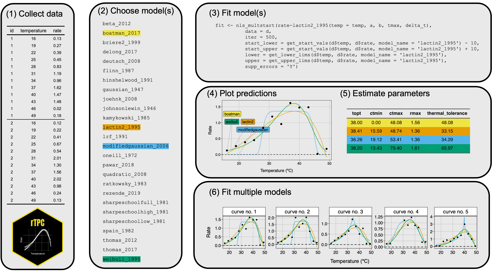
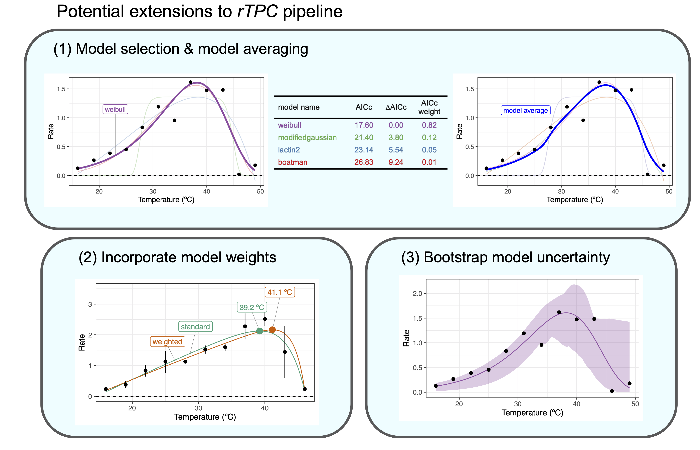

<!-- README.md is generated from README.Rmd. Please edit that file -->

```{r setup, include = FALSE}
knitr::opts_chunk$set(
  collapse = TRUE,
  comment = "#>",
  fig.path = "man/figures/README-",
  out.width = "100%"
)
```

# __rTPC__ 

<!-- badges: start -->
[](https://github.com/padpadpadpad/rTPC/actions)
<!-- badges: end -->

__rTPC__ is an R package that helps fit thermal performance curves (TPCs) in R. __rTPC__ contains 24 model formulations previously used to fit TPCs and has helper functions to help set sensible start parameters, upper and lower parameter limits and estimate parameters useful in downstream analyses, such as cardinal temperatures, maximum rate and optimum temperature.

The idea behind **rTPC** is to make fitting thermal performance curves easier, to provide workflows and examples of fitting TPCs without saying which model works best. Which model and which workflow is "best" is going to be down to the question that is being asked. Throughout the vignettes, *Things to consider* sections give some key considerations about what to consider _before_ and _during_ the analysis.

When developing **rTPC**, we made a conscious decision not to repeat code and methods that are already optimised and available in the R ecosystem. Consequently, the workflows take advantage of [**nls.multstart**](https://github.com/padpadpadpad/nls.multstart) for fitting non-linear least squares regression and packages from the [**tidyverse**](https://www.tidyverse.org) for data manipulation, fitting multiple models, and visualisation. The R package [**car**](https://cran.r-project.org/web/packages/car/car.pdf) is used extensively for the bootstrapping approaches.

**rTPC** and the pipelines outlined in the vignettes are in the process of being written up into a methods paper. In the meantime, please cite as:

Daniel Padfield and Hannah O'Sullivan (2020). rTPC: an R package for helping fit thermal performance curves. R package version 1.0.0.

## Bugs and suggestions

Please report any bugs and suggestions to the [Issues](https://github.com/padpadpadpad/rTPC/issues) or email d.padfield@exeter.ac.uk.

## Installation

__rTPC__ can easily be downloaded from GitHub using the `remotes::install_github()`. The vignettes are all available online, but if you would like to build them locally, add `build_vignettes = TRUE` into your `install_github()` command. However, we do not recommend doing this due to the number of extra R packages utilised in the vignettes.

```{r install, eval = FALSE}
# install package from GitHub
remotes::install_github("padpadpadpad/rTPC")
```

## General pipeline

**rTPC** makes it easy to fit multiple models to multiple thermal performance curves.



**Figure 1. General pipeline for fitting thermal performance curves using rTPC**. (1) Collect, check, and manipulate data into long format. (2) Choose which models from rTPC are going to be used. Here, a random assortment of four models were chosen. (3) Fit the models to data using nls.multstart and helper functions from rTPC. (4) Models can be visualised and (5) common traits of TPCs can be estimated using **rTPC::calc_params()**. (6) This simple pipeline can easily be scaled up to be used on multiple curves.

## Extensions to the pipeline

**rTPC** can also be easily used to do a number of common tasks needed when fitting TPCs, such as model selection, model averaging, incorporating model weights and bootstrapping of model fits.



**Figure 2. Potential applications for fitting thermal performance curves using rTPC**. (1) AIC, BIC or other metrics of model fit can be calculated to help to allow model selection or model averaging. (2) If TPCs are being fit to averages of multiple replicates, then weighted NLLS can be used that reduce parameter bias. (3) After the model has been fitted, non-parametric bootstrapping approaches can help estimate model uncertainty and calculate confidence intervals of parameters.

## Getting started

- For an introduction to **rTPC**, see `vignette("rTPC")`
- To follow the general pipeline, see `vignette("fit_many_models")` and `vignette("fit_many_curves")`.
- For examples of extensions to this pipeline, see the `vignette("model_averaging_selection")`, `vignette("model_weighting")`, `vignette("bootstrapping_models")` and `vignette("weighted_bootstrapping")`.
