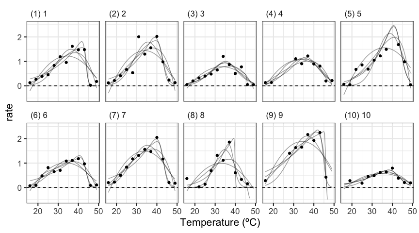
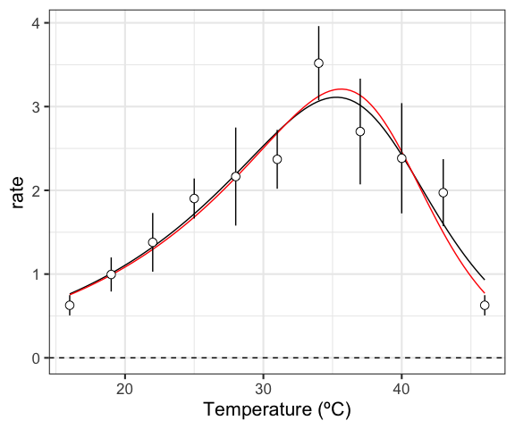
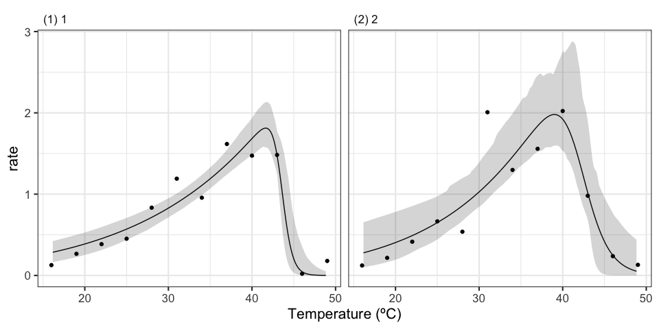

# __rTPC__ 

__rTPC__ is an R package that helps fit thermal performance curves (TPCs) in R. It contains all the models previously used to fit TPCs and has helper functions to help in setting sensible start parameters, upper and lower parameter limits and estimating parameters useful in downstream analyses, such as cardinal temperatures, maximum rate and optimum temperature.

## Bugs and suggestions

Please report any bugs and suggestions to the Issues tab or email d.padfield@exeter.ac.uk.

<!-- badges: start -->
  [](https://travis-ci.org/padpadpadpad/rTPC)
<!-- badges: end -->

## Jump to:

  - [Installation](#installation)
  - [Before you start modelling](#before-you-start-modelling)
  - [Fitting multiple models to a single
    curve](#fitting-multiple-models-to-a-single-curve)
  - [Fitting multiple models to multiple
    curves](#fitting-multiple-models-to-multiple-curves)
  - [Model selection](#model-selection)
  - [Model averaging](#model-averaging)
  - [Incorporating model weights](#incorporating-model-weights)
  - [Bootstrapping model fits](#bootstrapping-model-fits)

<!-- README.md is generated from README.Rmd. Please edit that file -->

## Installation

**rTPC** can easily be downloaded from GitHub using the
`remotes::install_github()`.

``` r
# install package from GitHub
remotes::install_github("padpadpadpad/rTPC")
```

We also need to install a bunch of other packages that will help with
the analysis pipeline.

``` r
# install other packages
install.packages('nls.multstart')
install.packages('purrr')
install.packages('dplyr')
install.packages('tidyr')
install.packages('ggplot2')
install.packages('broom')
install.packages('MuMIn')
```

Then we need to load in all the necessary packages.

``` r
# load in packages
library(purrr)
library(dplyr)
library(tidyr)
library(ggplot2)
library(broom)
library(MuMIn)
library(rTPC)
library(nls.multstart)

# write function to label ggplot2 panels
label_facets_num <- function(string){
  len <- length(string)
  string = paste('(', 1:len, ') ', string, sep = '')
  return(string)
}

# write function to convert label text size to points
pts <- function(x){
  as.numeric(grid::convertX(grid::unit(x, 'points'), 'mm'))
}
```

## Before you start modelling

Before fitting any of these models, it is likely that some filtering and
cleaning of the data needs to be done. Some things you should consider
are:

  - How many data points do you have for each curve? The more points the
    better for getting the best curve fits, but at the very least, there
    needs to be more points than unknown parameters. To fit all of the
    curves included here, that would mean having a minimum of 7 points
    per curve.
  - Do you have negative rate values? If you have a curve that crosses
    the x axis (i.e. there are negative rates), it might be beneficial
    to only consider models that are capable of modelling negative
    values. A summary of the models previously used in the literature is
    in the process of being made.
  - How is your data organised? If you have multiple curves, it makes
    sense to have your data in long format, where grouping variables,
    temperature and rate have their own columns, and different curves
    take up multiple rows, rather than a single row encompassing a
    single curve.

After you are happy that you understand your dataset and want to start
modelling your TPCs, we can do so using **rTPC**,
[**nls.multstart**](https://github.com/padpadpadpad/nls.multstart) and
tools from the **tidyverse**.

## Fitting multiple models to a single curve

**rTPC** makes it easy to fit multiple different models to the same
data. To fit each curve, we will use **nls.multstart**, which allows for
multiple starting parameters when fitting non-linear regressions to
improve the robustness and reproducibility of model fitting.

**rTPC** comes with a set of TPCs of photosynthesis and respiration of
the aquatic algae, *Chlorella vulgaris*, from Padfield *et al.* (2016).
There are 60 curves overall.

``` r
# load in data
data("chlorella_tpc")
d <- chlorella_tpc

# show the data
ggplot(d, aes(temp, rate, group = curve_id)) +
  facet_grid(flux ~growth_temp) +
  geom_point(alpha = 0.5) +
  geom_line(alpha = 0.5) +
  theme_bw()
```


First, we shall fit each model to just a single curve using
**nls.multstart::nlsmultstart()**. To do this, we take advantage of some
packages from the **tidyverse**, specifically **purrr**, **dplyr**, and
**tidyr**. In short, we specify the grouping variables of the dataset
(less applicable for a single curve) and then add a column for each
different model fit. This results in a list column, where the actual fit
is stored in the dataframe. This allows us increased flexibility
compared to other methods such as extracting the parameters from the
model and storing them in a list.

**rTPC** contains helper functions to aid in model fitting. First,
**get\_start\_vals()** estimates start values for the specified model.
These start values are estimated from the data where possible, but
otherwise represent averages of previously reported parameters from the
literature. Second, **get\_lower\_lims()** and **get\_upper\_lims()**
set wide lower and upper limits for the model specified. These are
needed as some models have multiple solutions, which means that some
estimated parameters are meaningless even though they represent the best
solution. These are currently not available for all models, but we aim
to do so soon.

``` r
# filter data for just a single curve
d_1 <- filter(d, curve_id == 1)

# run in purrr - going to be a huge long command this one
d_models <- group_by(d_1, curve_id, growth_temp, process, flux) %>%
  nest() %>%
  mutate(., lactin2 = map(data, ~nls_multstart(rate ~ lactin2_1995(temp = temp, a, b, tmax, delta_t),
                       data = .x,
                       iter = 500,
                       start_lower = get_start_vals(.x$temp, .x$rate, model_name = 'lactin2_1995') - 2,
                       start_upper = get_start_vals(.x$temp, .x$rate, model_name = 'lactin2_1995') + 2,
                       supp_errors = 'Y')),
            sharpeschoolhigh = map(data, ~nls_multstart(rate ~ sharpeschoolhigh_1981(temp = temp, r_tref, e, eh, th, tref = 15),
                                           data = .x,
                                           iter = 500,
                                           start_lower = get_start_vals(.x$temp, .x$rate, model_name = 'sharpeschoolhigh_1981') - 10,
                                           start_upper = get_start_vals(.x$temp, .x$rate, model_name = 'sharpeschoolhigh_1981') + 10,
                                           supp_errors = 'Y')),
            johnsonlewin = map(data, ~nls_multstart(rate ~ johnsonlewin_1946(temp = temp, r0, e, eh, topt),
                                           data = .x,
                                           iter = 500,
                                           start_lower = c(r0 = 1e9, e = 0, eh = 0, topt = 270),
                                           start_upper = c(r0 = 1e11, e = 2, eh = 10, topt = 330),
                                           supp_errors = 'Y')),
            thomas = map(data, ~nls_multstart(rate ~ thomas_2012(temp = temp, a, b, c, topt),
                                           data = .x,
                                           iter = 500,
                                           start_lower = get_start_vals(.x$temp, .x$rate, model_name = 'thomas_2012') - 1,
                                           start_upper = get_start_vals(.x$temp, .x$rate, model_name = 'thomas_2012') + 2,
                                           supp_errors = 'Y',
                                           lower = get_lower_lims(.x$temp, .x$rate, model_name = 'thomas_2012'))),
            briere2 = map(data, ~nls_multstart(rate ~ briere2_1999(temp = temp, tmin, tmax, a, b),
                                           data = .x,
                                           iter = 500,
                                           start_lower = get_start_vals(.x$temp, .x$rate, model_name = 'briere2_1999') - 1,
                                           start_upper = get_start_vals(.x$temp, .x$rate, model_name = 'briere2_1999') + 1,
                                           supp_errors = 'Y',
                                           lower = get_lower_lims(.x$temp, .x$rate, model_name = 'briere2_1999'),
                                           upper = get_upper_lims(.x$temp, .x$rate, model_name = 'briere2_1999'))),
            spain = map(data, ~nls_multstart(rate ~ spain_1982(temp = temp, a, b, c, r0),
                                           data = .x,
                                           iter = 500,
                                           start_lower = c(a = -1, b = -1, c = -1, r0 = -1),
                                           start_upper = c(a = 1, b = 1, c = 1, r0 = 1),
                                           supp_errors = 'Y')),
            ratkowsky = map(data, ~nls_multstart(rate ~ ratkowsky_1983(temp = temp, tmin, tmax, a, b),
                                           data = .x,
                                           iter = 500,
                                           start_lower = get_start_vals(.x$temp, .x$rate, model_name = 'ratkowsky_1983') - 2,
                                           start_upper = get_start_vals(.x$temp, .x$rate, model_name = 'ratkowsky_1983') + 2,
                                           supp_errors = 'Y')),
            boatman = map(data, ~nls_multstart(rate ~ boatman_2017(temp = temp, rmax, tmin, tmax, a, b),
                                           data = .x,
                                           iter = 500,
                                           start_lower = get_start_vals(.x$temp, .x$rate, model_name = 'boatman_2017') -1,
                                           start_upper = get_start_vals(.x$temp, .x$rate, model_name = 'boatman_2017') + 1,
                                           supp_errors = 'Y')),
            flinn = map(data, ~nls_multstart(rate ~ flinn_1991(temp = temp, a, b, c),
                                           data = .x,
                                           iter = 500,
                                           start_lower = get_start_vals(.x$temp, .x$rate, model_name = 'flinn_1991') - 10,
                                           start_upper = get_start_vals(.x$temp, .x$rate, model_name = 'flinn_1991') + 10,
                                           supp_errors = 'Y')),
            gaussian = map(data, ~nls_multstart(rate ~ gaussian_1987(temp = temp, rmax, topt, a),
                                           data = .x,
                                           iter = 500,
                                           start_lower = get_start_vals(.x$temp, .x$rate, model_name = 'gaussian_1987') - 2,
                                           start_upper = get_start_vals(.x$temp, .x$rate, model_name = 'gaussian_1987') + 2,
                                           supp_errors = 'Y')),
            oneill = map(data, ~nls_multstart(rate ~ oneill_1972(temp = temp, rmax, tmax, topt, q10),
                                           data = .x,
                                           iter = 500,
                                           start_lower = get_start_vals(.x$temp, .x$rate, model_name = 'oneill_1972') - 1,
                                           start_upper = get_start_vals(.x$temp, .x$rate, model_name = 'oneill_1972') + 1,
                                           supp_errors = 'Y')),
            joehnk = map(data, ~nls_multstart(rate ~ joehnk_2008(temp = temp, rmax, topt, a, b, c),
                                           data = .x,
                                           iter = 500,
                                           start_lower = get_start_vals(.x$temp, .x$rate, model_name = 'joehnk_2008') - 1,
                                           start_upper = get_start_vals(.x$temp, .x$rate, model_name = 'joehnk_2008') + 1,
                                           supp_errors = 'Y',
                                           lower = get_lower_lims(.x$temp, .x$rate, model_name = 'joehnk_2008'))),
            kamykowski = map(data, ~nls_multstart(rate ~ kamykowski_1985(temp = temp, tmin, tmax, a, b, c),
                                           data = .x,
                                           iter = 500,
                                           start_lower = get_start_vals(.x$temp, .x$rate, model_name = 'kamykowski_1985') - 1,
                                           start_upper = get_start_vals(.x$temp, .x$rate, model_name = 'kamykowski_1985') + 1,
                                           supp_errors = 'Y')),
            quadratic = map(data, ~nls_multstart(rate ~ quadratic_2008(temp = temp, a, b, c),
                                           data = .x,
                                           iter = 500,
                                           start_lower = c(a = 0, b = -2, c = -1),
                                           start_upper = c(a = 30, b = 2, c = 1),
                                           supp_errors = 'Y')),
            hinshelwood = map(data, ~nls_multstart(rate ~ hinshelwood_1947(temp = temp, a, e, c, eh),
                                           data = .x,
                                           iter = 500,
                                           start_lower = get_start_vals(.x$temp, .x$rate, model_name = 'hinshelwood_1947') * 0.1,
                                           start_upper = get_start_vals(.x$temp, .x$rate, model_name = 'hinshelwood_1947') * 10,
                                           supp_errors = 'Y')),
            sharpeschoolfull = map(data, ~nls_multstart(rate ~ sharpeschoolfull_1981(temp = temp, r_tref, e, el, tl, eh, th, tref = 15),
                                           data = .x,
                                           iter = 500,
                                           start_lower = get_start_vals(.x$temp, .x$rate, model_name = 'sharpeschoolfull_1981') - 10,
                                           start_upper = get_start_vals(.x$temp, .x$rate, model_name = 'sharpeschoolfull_1981') + 10,
                                           supp_errors = 'Y')),
            sharpeschoollow = map(data, ~nls_multstart(rate ~ sharpeschoollow_1981(temp = temp, r_tref, e, el, tl, tref = 15),
                                           data = .x,
                                           iter = 500,
                                           start_lower = c(r_tref = 0.01, e = 0, el = 0, tl = 270),
                                           start_upper = c(r_tref = 2, e = 3, el = 10, tl = 330),
                                           supp_errors = 'Y')),
            weibull = map(data, ~nls_multstart(rate ~ weibull_1995(temp = temp, a, topt, b, c),
                                           data = .x,
                                           iter = 500,
                                           start_lower = c(a = 0, topt = 30, b = 100, c = 10),
                                           start_upper = c(a = 3, topt = 50, b = 200, c = 50),
                                           lower = c(a = 0, topt = 20, b = 0, c = 0),
                                           supp_errors = 'Y')),
            rezende = map(data, ~nls_multstart(rate ~ rezende_2019(temp = temp, a, q10, b, c),
                                           data = .x,
                                           iter = 500,
                                           start_lower = get_start_vals(.x$temp, .x$rate, model_name = 'rezende_2019') * 0.8,
                                           start_upper = get_start_vals(.x$temp, .x$rate, model_name = 'rezende_2019') * 1.2,
                                           upper = get_upper_lims(.x$temp, .x$rate, model_name = 'rezende_2019'),
                                           lower = get_lower_lims(.x$temp, .x$rate, model_name = 'rezende_2019'),
                                           supp_errors = 'Y')))
```

The predictions of each model can be extracted using
**broom::augment()**, after we stack all of our models into long format.
To allow for a smooth curve, we produce a new temperature vector that
has 100 points instead of our original data which just has 8.

We can also grab all the parameters of the model using
**broom::tidy()**. This is useful if using just a single model, but as
parameter meanings do not transfer well across models, using this to
compare models is limited.

Nevertheless, we can extract parameters and visualise our model fits.

``` r
# stack models
d_stack <- gather(d_models, 'model', 'output', 6:ncol(d_models))

# preds
newdata <- tibble(temp = seq(min(d_1$temp), max(d_1$temp), length.out = 100))
d_preds <- d_stack %>%
  mutate(., preds = map(output, augment, newdata = newdata)) %>%
  unnest(preds)

# estimate parameters
params <- d_stack %>%
  mutate(., est = map(output, tidy)) %>%
  select(., -c(data, output)) %>%
  unnest(est)

# plot fit
ggplot(d_preds, aes(temp, rate)) +
  geom_point(aes(temp, rate), d_1) +
  geom_line(aes(temp, .fitted, col = model)) +
  facet_wrap(~model, labeller = labeller(model = label_facets_num)) +
  theme_bw(base_size = 16) +
  theme(legend.position = 'none',
        strip.text = element_text(hjust = 0),
        strip.background = element_blank()) +
  xlab('Temperature (ºC)') +
  ylab('rate') +
  geom_hline(aes(yintercept = 0), linetype = 2)
```


If a given model has not fit, they are not included in the panel plot.

### Estimating traits of the TPC

A common motivation for fitting a particular model is that a desired
term (e.g. the optimum temperature
)
is specifically defined in the model. However, these parameters can also
be derived from any given model fit, by estimating parameters from high
resolution predictions of the model.

**rTPC** comes with a bunch of helper functions to estimate common
traits that are extracted from TPCs, such as optimum temperature,
**get\_topt()**, maximal rate, **get\_rmax()**, and activation energy,
**get\_e()**. These functions can all be called at once using
**est\_params()**.

``` r
# estimate extra parameters
params_extra <- d_stack %>%
  mutate(., est = map(output, est_params)) %>%
  select(., -c(data, output)) %>%
  unnest(est) %>%
  ungroup() %>%
  select(c(model, rmax:ncol(.))) %>%
  mutate_if(is.numeric, function(x) round(x, 2))

# set column names for html table
col_names <- c('model', 'Rmax', 'Topt', 'CTmin', 'CTmax', 'E', 'Eh', 'Q10', 'thermal\nsafety\nmargin', 'tolerance\nrange', 'skewness')

# show the table of extra parameters
head(params_extra) %>%
  kableExtra::kable(., col.names = col_names, align = 'c') %>%
  kableExtra::kable_styling(font_size = 14, bootstrap_options = c("striped", "hover", "condensed"), position = 'center')
```

<table class="table table-striped table-hover table-condensed" style="font-size: 14px; margin-left: auto; margin-right: auto;">

<thead>

<tr>

<th style="text-align:center;">

model

</th>

<th style="text-align:center;">

Rmax

</th>

<th style="text-align:center;">

Topt

</th>

<th style="text-align:center;">

CTmin

</th>

<th style="text-align:center;">

CTmax

</th>

<th style="text-align:center;">

E

</th>

<th style="text-align:center;">

Eh

</th>

<th style="text-align:center;">

Q10

</th>

<th style="text-align:center;">

thermal safety margin

</th>

<th style="text-align:center;">

tolerance range

</th>

<th style="text-align:center;">

skewness

</th>

</tr>

</thead>

<tbody>

<tr>

<td style="text-align:center;">

lactin2

</td>

<td style="text-align:center;">

1.36

</td>

<td style="text-align:center;">

38.41

</td>

<td style="text-align:center;">

15.59

</td>

<td style="text-align:center;">

48.74

</td>

<td style="text-align:center;">

0.72

</td>

<td style="text-align:center;">

1.74

</td>

<td style="text-align:center;">

2.48

</td>

<td style="text-align:center;">

10.33

</td>

<td style="text-align:center;">

33.15

</td>

<td style="text-align:center;">

\-0.34

</td>

</tr>

<tr>

<td style="text-align:center;">

sharpeschoolhigh

</td>

<td style="text-align:center;">

1.81

</td>

<td style="text-align:center;">

41.65

</td>

<td style="text-align:center;">

2.54

</td>

<td style="text-align:center;">

45.56

</td>

<td style="text-align:center;">

0.58

</td>

<td style="text-align:center;">

11.48

</td>

<td style="text-align:center;">

2.06

</td>

<td style="text-align:center;">

3.91

</td>

<td style="text-align:center;">

43.02

</td>

<td style="text-align:center;">

\-0.67

</td>

</tr>

<tr>

<td style="text-align:center;">

johnsonlewin

</td>

<td style="text-align:center;">

0.88

</td>

<td style="text-align:center;">

37.77

</td>

<td style="text-align:center;">

\-16.62

</td>

<td style="text-align:center;">

Inf

</td>

<td style="text-align:center;">

0.72

</td>

<td style="text-align:center;">

1.74

</td>

<td style="text-align:center;">

2.48

</td>

<td style="text-align:center;">

Inf

</td>

<td style="text-align:center;">

Inf

</td>

<td style="text-align:center;">

\-0.11

</td>

</tr>

<tr>

<td style="text-align:center;">

thomas

</td>

<td style="text-align:center;">

1.36

</td>

<td style="text-align:center;">

38.37

</td>

<td style="text-align:center;">

15.43

</td>

<td style="text-align:center;">

48.73

</td>

<td style="text-align:center;">

0.72

</td>

<td style="text-align:center;">

1.74

</td>

<td style="text-align:center;">

2.48

</td>

<td style="text-align:center;">

10.36

</td>

<td style="text-align:center;">

33.31

</td>

<td style="text-align:center;">

\-0.36

</td>

</tr>

<tr>

<td style="text-align:center;">

briere2

</td>

<td style="text-align:center;">

1.33

</td>

<td style="text-align:center;">

37.12

</td>

<td style="text-align:center;">

16.75

</td>

<td style="text-align:center;">

48.88

</td>

<td style="text-align:center;">

0.72

</td>

<td style="text-align:center;">

1.74

</td>

<td style="text-align:center;">

2.48

</td>

<td style="text-align:center;">

11.77

</td>

<td style="text-align:center;">

32.14

</td>

<td style="text-align:center;">

\-0.19

</td>

</tr>

<tr>

<td style="text-align:center;">

spain

</td>

<td style="text-align:center;">

1.33

</td>

<td style="text-align:center;">

39.96

</td>

<td style="text-align:center;">

\-1.37

</td>

<td style="text-align:center;">

48.67

</td>

<td style="text-align:center;">

0.72

</td>

<td style="text-align:center;">

1.74

</td>

<td style="text-align:center;">

2.48

</td>

<td style="text-align:center;">

8.71

</td>

<td style="text-align:center;">

50.05

</td>

<td style="text-align:center;">

\-0.38

</td>

</tr>

</tbody>

</table>

## Fitting multiple models to multiple curves

One benefit of this pipeline using **purrr::map()** is its scalability
to fitting single or multiple models to multiple thermal performance
curves. To demonstrate this, we fitted a few select models (gaussian,
the full Sharpe-Schoolfield model, the Sharpe-Schoolfield model for high
temperature inactivation, the quadratic model, and the Lactin2 model) to
the first 10 curves in the example dataset.

In doing this, we alter the original code for **nls\_multstart()** to
include a progress bar. We calculate the total number of models to be
fitted as: .

``` r
# filter 15 curves
d_10 <- filter(d, curve_id <= 10)

# when scaling up our code to fit hundreds of models, its nice to have a progress bar
nls_multstart_progress <- function(formula, data = parent.frame(), iter, start_lower, 
                                   start_upper, supp_errors = c("Y", "N"), convergence_count = 100, 
                                   control, modelweights, ...){
  if(!is.null(pb)){
    pb$tick()$print()
  }
  nls_multstart(formula = formula, data = data, iter = iter, start_lower = start_lower, 
                start_upper = start_upper, supp_errors = supp_errors, convergence_count = convergence_count, 
                control = control, modelweights = modelweights, ...)
}


# start progress bar and estimate time it will take
number_of_models <- 5
number_of_curves <- length(unique(d_10$curve_id))

# setup progress bar
pb <- progress_estimated(number_of_curves*number_of_models)

# run each model on each curve
d_models <- group_by(d_10, curve_id, growth_temp, process, flux) %>%
  nest() %>%
  mutate(., lactin2 = map(data, ~nls_multstart_progress(rate ~ lactin2_1995(temp = temp, p, c, tmax, delta_t),
                       data = .x,
                       iter = 500,
                       start_lower = c(p = 0, c = -2, tmax = 35, delta_t = 0),
                       start_upper = c(p = 3, c = 0, tmax = 55, delta_t = 15),
                       supp_errors = 'Y')),
            sharpeschoolhigh = map(data, ~nls_multstart_progress(rate ~ sharpeschoolhigh_1981(temp = temp, r_tref, e, eh, th, tref = 15),
                       data = .x,
                       iter = 500,
                       start_lower = get_start_vals(.x$temp, .x$rate, model_name = 'sharpeschoolhigh_1981') - 5,
                       start_upper = get_start_vals(.x$temp, .x$rate, model_name = 'sharpeschoolhigh_1981') + 5,
                       supp_errors = 'Y')),
            gaussian = map(data, ~nls_multstart_progress(rate ~ gaussian_1987(temp = temp, rmax, topt, a),
                        data = .x,
                        iter = 500,
                        start_lower = c(rmax = 0, topt = 20, a = 0),
                        start_upper = c(rmax = 2, topt = 40, a = 30),
                        supp_errors = 'Y')),
            quadratic = map(data, ~nls_multstart_progress(rate ~ quadratic_2008(temp = temp, a, b, c),
                        data = .x,
                        iter = 500,
                        start_lower = c(a = 0, b = -2, c = -1),
                        start_upper = c(a = 30, b = 2, c = 1),
                        supp_errors = 'Y')),
            sharpeschoolfull = map(data, ~nls_multstart_progress(rate ~ sharpeschoolfull_1981(temp = temp, r_tref, e, el, tl, eh, th, tref = 15),
                        data = .x,
                        iter = 500,
                        start_lower = get_start_vals(.x$temp, .x$rate, model_name = 'sharpeschoolfull_1981') - 5,
                        start_upper = get_start_vals(.x$temp, .x$rate, model_name = 'sharpeschoolfull_1981') + 5,
                        supp_errors = 'Y')))
```

We can easily then visualise the fit of each curve for each fit.

``` r
# stack models
d_stack <- gather(d_models, 'model', 'output', 6:ncol(d_models))

# preds
new_data <- tibble(temp = seq(min(d_1$temp), max(d_1$temp), length.out = 100))

# get preds
d_preds <- d_stack %>%
  mutate(., preds = map(output, augment, newdata = newdata)) %>%
  unnest(preds)

# plot preds
lines <- data.frame(val = 0, curve_id = 1:10)

ggplot() +
  geom_point(aes(temp, rate), d_10) +
  geom_line(aes(temp, .fitted, group = model), alpha = 0.4, d_preds) +
  facet_wrap(~ curve_id, ncol = 5, labeller = labeller(curve_id = label_facets_num)) +
  theme_bw(base_size = 16) +
  theme(legend.position = 'none',
        strip.text = element_text(hjust = 0),
        strip.background = element_blank()) +
  xlab('Temperature (ºC)') +
  ylab('rate') +
  geom_hline(aes(yintercept = val), linetype = 2, lines) +
  ylim(c(-0.5, 2.5))
```



And extract the parameters for each model for each curve. We can then
plot these across each model for each TPC.

``` r
# estimate extra parameters
params_extra <- d_stack %>%
  mutate(., est = map(output, est_params)) %>%
  select(., -c(data, output)) %>%
  unnest(est)

params_extra <- gather(params_extra, 'term', 'estimate', rmax:ncol(params_extra))

# create jitter position with seeding
pos <- position_dodge(0.4)

ggplot(params_extra, aes(model, estimate, group = curve_id)) +
  geom_line(position = pos, alpha = 0.5) +
  geom_point(position = pos, shape = 21, fill = 'white') +
  facet_wrap(~ term, scales = 'free_y', ncol = 5, labeller = labeller(term = label_facets_num)) +
  theme_bw() +
  theme(legend.position = 'none',
        strip.text = element_text(hjust = 0),
        strip.background = element_blank(),
        axis.text.x = element_text(angle = 30, hjust = 1))
```


We can see, somewhat unsurprisingly, that there is as much variation
between models as there is between curves.

## Model selection

It is very easy to incorporate model selection approaches into fitting
these models to TPCs. **broom::glance()** returns summary information on
each fit, inluding some information criterion such as **AIC** and
**BIC**. An example of this is shown below.

``` r
d_stack %>%
  mutate(., info = map(output, glance)) %>%
  select(., curve_id, model, info) %>%
  unnest(info) %>%
  arrange(curve_id) %>%
  select(curve_id, model, sigma, isConv, logLik, AIC, BIC, deviance, df.residual) %>%
  head(5) %>%
  kableExtra::kable(align = 'c', digits = 2) %>%
  kableExtra::kable_styling(font_size = 14, bootstrap_options = c("striped", "hover", "condensed"), position = 'center')
#> Adding missing grouping variables: `growth_temp`, `process`, `flux`
#> Adding missing grouping variables: `growth_temp`, `process`, `flux`
```

<table class="table table-striped table-hover table-condensed" style="font-size: 14px; margin-left: auto; margin-right: auto;">

<thead>

<tr>

<th style="text-align:center;">

growth\_temp

</th>

<th style="text-align:center;">

process

</th>

<th style="text-align:center;">

flux

</th>

<th style="text-align:center;">

curve\_id

</th>

<th style="text-align:center;">

model

</th>

<th style="text-align:center;">

sigma

</th>

<th style="text-align:center;">

isConv

</th>

<th style="text-align:center;">

logLik

</th>

<th style="text-align:center;">

AIC

</th>

<th style="text-align:center;">

BIC

</th>

<th style="text-align:center;">

deviance

</th>

<th style="text-align:center;">

df.residual

</th>

</tr>

</thead>

<tbody>

<tr>

<td style="text-align:center;">

20

</td>

<td style="text-align:center;">

acclimation

</td>

<td style="text-align:center;">

respiration

</td>

<td style="text-align:center;">

1

</td>

<td style="text-align:center;">

lactin2

</td>

<td style="text-align:center;">

0.34

</td>

<td style="text-align:center;">

TRUE

</td>

<td style="text-align:center;">

\-1.57

</td>

<td style="text-align:center;">

13.14

</td>

<td style="text-align:center;">

15.56

</td>

<td style="text-align:center;">

0.91

</td>

<td style="text-align:center;">

8

</td>

</tr>

<tr>

<td style="text-align:center;">

20

</td>

<td style="text-align:center;">

acclimation

</td>

<td style="text-align:center;">

respiration

</td>

<td style="text-align:center;">

1

</td>

<td style="text-align:center;">

sharpeschoolhigh

</td>

<td style="text-align:center;">

0.20

</td>

<td style="text-align:center;">

TRUE

</td>

<td style="text-align:center;">

4.83

</td>

<td style="text-align:center;">

0.35

</td>

<td style="text-align:center;">

2.77

</td>

<td style="text-align:center;">

0.31

</td>

<td style="text-align:center;">

8

</td>

</tr>

<tr>

<td style="text-align:center;">

20

</td>

<td style="text-align:center;">

acclimation

</td>

<td style="text-align:center;">

respiration

</td>

<td style="text-align:center;">

1

</td>

<td style="text-align:center;">

gaussian

</td>

<td style="text-align:center;">

0.33

</td>

<td style="text-align:center;">

TRUE

</td>

<td style="text-align:center;">

\-1.88

</td>

<td style="text-align:center;">

11.76

</td>

<td style="text-align:center;">

13.70

</td>

<td style="text-align:center;">

0.96

</td>

<td style="text-align:center;">

9

</td>

</tr>

<tr>

<td style="text-align:center;">

20

</td>

<td style="text-align:center;">

acclimation

</td>

<td style="text-align:center;">

respiration

</td>

<td style="text-align:center;">

1

</td>

<td style="text-align:center;">

quadratic

</td>

<td style="text-align:center;">

0.41

</td>

<td style="text-align:center;">

TRUE

</td>

<td style="text-align:center;">

\-4.55

</td>

<td style="text-align:center;">

17.09

</td>

<td style="text-align:center;">

19.03

</td>

<td style="text-align:center;">

1.50

</td>

<td style="text-align:center;">

9

</td>

</tr>

<tr>

<td style="text-align:center;">

20

</td>

<td style="text-align:center;">

acclimation

</td>

<td style="text-align:center;">

respiration

</td>

<td style="text-align:center;">

1

</td>

<td style="text-align:center;">

sharpeschoolfull

</td>

<td style="text-align:center;">

0.18

</td>

<td style="text-align:center;">

TRUE

</td>

<td style="text-align:center;">

7.52

</td>

<td style="text-align:center;">

\-1.03

</td>

<td style="text-align:center;">

2.36

</td>

<td style="text-align:center;">

0.20

</td>

<td style="text-align:center;">

6

</td>

</tr>

</tbody>

</table>

However, TPCs are often data-poor, with not many more points than
parameters being fitted. In such instances, **AICc** is useful as it
applies a correction for small sample sizes and is implemented using
**MuMIn::AICc()**.

When doing model selection across multiple curves, it is important to
have defined and consistent rules at the beginning of the process. Here,
I define the “best” model for the data overall as the model that has the
lowest **AICc** score for the most individual TPCs.

``` r
# calculate AICc score and filter for the best model for each curve_id
table <- mutate(d_stack, aic = map_dbl(output, possibly(MuMIn::AICc, NA))) %>%
  filter(., !is.na(aic)) %>%
  group_by(curve_id) %>%
  top_n(1, desc(aic)) %>%
  group_by(model) %>%
  tally() %>%
  full_join(., tibble(model = unique(d_stack$model))) %>%
  mutate(., n = replace_na(n, 0)) %>%
  kableExtra::kable(align = 'c', digits = 2) %>%
  kableExtra::kable_styling(font_size = 14, bootstrap_options = c("striped", "hover", "condensed"), position = 'center')
#> Joining, by = "model"

table
```

<table class="table table-striped table-hover table-condensed" style="font-size: 14px; margin-left: auto; margin-right: auto;">

<thead>

<tr>

<th style="text-align:center;">

model

</th>

<th style="text-align:center;">

n

</th>

</tr>

</thead>

<tbody>

<tr>

<td style="text-align:center;">

gaussian

</td>

<td style="text-align:center;">

6

</td>

</tr>

<tr>

<td style="text-align:center;">

sharpeschoolhigh

</td>

<td style="text-align:center;">

4

</td>

</tr>

<tr>

<td style="text-align:center;">

lactin2

</td>

<td style="text-align:center;">

0

</td>

</tr>

<tr>

<td style="text-align:center;">

quadratic

</td>

<td style="text-align:center;">

0

</td>

</tr>

<tr>

<td style="text-align:center;">

sharpeschoolfull

</td>

<td style="text-align:center;">

0

</td>

</tr>

</tbody>

</table>

So using this specific multi-model selection approach over multiple
TPCs, in this instance I would favour using the gaussian model for the
entire analysis.

## Model averaging

In turn, perhaps we want to use information criterion to implement model
averaging techniques. Using **AICc** scores, we can calculate model
weighted predictions of best overall model fit. We average the
predictions using the weight of every given model, but it is very easy
to use a cut-off for model inclusion of  from the lowest **AICc** score if
desired.

``` r
# calculate AICc score and weight models
d_stack <- mutate(d_stack, aic = map_dbl(output, possibly(MuMIn::AICc, NA))) %>%
  filter(., !is.na(aic)) %>%
  group_by(curve_id) %>%
  # filter(., aic - min(aic) <= 2) %>%
  mutate(., weight = MuMIn::Weights(aic)) %>%
  ungroup()

# calculate average prediction
ave_preds <- merge(d_preds, select(d_stack, model, weight, curve_id), by = c('model', 'curve_id')) %>%
  mutate(., temp = round(temp, 2)) %>%
  group_by(temp, curve_id) %>%
  summarise(., ave_pred = sum(.fitted*weight)) %>%
  ungroup()

# plot these
lines <- data.frame(val = 0, curve_id = 1:10)
ggplot() +
  geom_point(aes(temp, rate), d_10) +
  geom_line(aes(temp, .fitted, group = model), alpha = 0.1, d_preds) +
  geom_line(aes(temp, ave_pred), ave_preds, size = 1) +
  theme_bw(base_size = 16) +
  theme(legend.position = 'none',
        strip.text = element_text(hjust = 0),
        strip.background = element_blank()) +
  facet_wrap(~ curve_id, ncol = 5, labeller = labeller(curve_id = label_facets_num)) +
  xlab('Temperature (ºC)') +
  ylab('rate') +
  ylim(c(-0.5, 2.5)) +
  geom_hline(aes(yintercept = val), linetype = 2, lines)
```


There will be eventually be a version of **est\_params()** that can work
on a set of these predictions.

## Incorporating model weights

Methods of fitting TPCs in the literature often fit models to averaged
rate values at each temperature. This fits a model on the mean rate
value, but often the uncertainty around the mean value is ignored.

Instead, we can incorporate model uncertainty using the **weights**
argument within **nls\_multstart()**. The optimal weights are
, so can easily be included if you have any value of
uncertainty for your rate values.

I will demonstrate how it works by averaging across the 3 biological
replicates for a given curve, calculating the standard deviation,
 for
each mean rate value and fitting the Sharpe-Schoolfield model for high
temperature inactivation to (a) only the average rate at each
temperature and (b) the average rate and the standard deviation at each
temperature.

``` r
d_ave <- filter(d, process == 'adaptation', growth_temp == 20, flux == 'photosynthesis') %>%
  group_by(temp) %>%
  summarise(., sd = sd(rate),
            ave_rate = mean(rate)) %>%
  ungroup()

# run both models
d_models <- nest(d_ave) %>%
  mutate(., mod = map(data, ~nls_multstart(ave_rate ~ sharpeschoolhigh_1981(temp = temp, r_tref, e, eh, th, tref = 15),
                                           data = .x,
                                           iter = 500,
                                           start_lower = get_start_vals(.x$temp, .x$ave_rate, model_name = 'sharpeschoolhigh_1981') - 10,
                                           start_upper = get_start_vals(.x$temp, .x$ave_rate, model_name = 'sharpeschoolhigh_1981') + 10,
                                           lower = get_lower_lims(.x$temp, .x$ave_rate, model_name = 'sharpeschoolhigh_1981'),
                                           upper = get_upper_lims(.x$temp, .x$ave_rate, model_name = 'sharpeschoolhigh_1981'),
                                           supp_errors = 'Y')),
         mod_weights = map(data, ~nls_multstart(ave_rate ~ sharpeschoolhigh_1981(temp = temp, r_tref, e, eh, th, tref = 15),
                                           data = .x,
                                           iter = 500,
                                           start_lower = get_start_vals(.x$temp, .x$ave_rate, model_name = 'sharpeschoolhigh_1981') - 10,
                                           start_upper = get_start_vals(.x$temp, .x$ave_rate, model_name = 'sharpeschoolhigh_1981') + 10,
                                           lower = get_lower_lims(.x$temp, .x$ave_rate, model_name = 'sharpeschoolhigh_1981'),
                                           upper = get_upper_lims(.x$temp, .x$ave_rate, model_name = 'sharpeschoolhigh_1981'),
                                           supp_errors = 'Y',
                                           # include weights here!
                                           modelweights = 1/sd)))
#> Warning: `...` must not be empty for ungrouped data frames.
#> Did you want `data = everything()`?

# calculate predictions
d_stack <- gather(d_models, 'model', 'output', starts_with('mod'))

# preds
newdata <- tibble(temp = seq(min(d_ave$temp), max(d_ave$temp), length.out = 100))
d_preds <- d_stack %>%
  mutate(., preds = map(output, augment, newdata = newdata)) %>%
  unnest(preds)

# plot
ggplot() +  
  geom_line(aes(temp, .fitted, group = model, col = model), d_preds) +
  geom_linerange(aes(x = temp, ymin = ave_rate - sd, ymax = ave_rate + sd), d_ave) +
  geom_point(aes(temp, ave_rate), d_ave, size = 3, shape = 21, fill = 'white') +
  theme_bw(base_size = 16) +
  theme(legend.position = 'none',
        strip.text = element_text(hjust = 0),
        strip.background = element_blank()) +
  xlab('Temperature (ºC)') +
  ylab('rate') +
  geom_hline(aes(yintercept = 0), linetype = 2) +
  scale_color_manual(values = c('black', 'red'))
```



Here, the curve that incorporates model weights (in red) makes very
little difference to the curve fit, but this will obviously depend on
how much variation there is in your uncertainty across temperatures.

## Bootstrapping model fits

We can bootstrap our models to (a) visualise uncertainty of our model
and its predictions and (b) allow us to quantify the uncertainty of the
derived parameters in **est\_params()**. This example uses
non-parametric bootstrapping, where we sample from the residuals of the
original model fit. This is an identical approach to that implemented in
**nlstools::nlsBoot()**, but we retain each model fit in order to
calculate confidence intervals for predictions and derived parameters.

To demonstrate the approach, we will bootstrap the first two curves in
**chlorella\_tpc** after fitting the Sharpe-Schoolfield model for high
temperature inactivation.

``` r
# subset data
d_2 <- filter(chlorella_tpc, curve_id <= 2)

# fit nls.multstart
d_fits <- d_2 %>%
  group_by(curve_id) %>%
  nest() %>%
  mutate(fit = purrr::map(data, ~ nls_multstart(rate ~ sharpeschoolhigh_1981(temp = temp, r_tref, e, eh, th, tref = 15),
                                           data = .x,
                                           iter = 500,
                                           start_lower = get_start_vals(.x$temp, .x$rate, model_name = 'sharpeschoolhigh_1981') - 10,
                                           start_upper = get_start_vals(.x$temp, .x$rate, model_name = 'sharpeschoolhigh_1981') + 10,
                                           lower = get_lower_lims(.x$temp, .x$rate, model_name = 'sharpeschoolhigh_1981'),
                                           upper = get_upper_lims(.x$temp, .x$rate, model_name = 'sharpeschoolhigh_1981'),
                                           supp_errors = 'Y')))

# get preds for each point
preds <- d_fits %>%
  mutate(., pred = map(fit, augment)) %>%
  unnest(pred) %>%
  select(., - c(X.weights.)) 

# define number of bootstraps
nboot <- 250

# start progress bar and estimate time it will take
number_of_models <- 1
number_of_curves <- length(unique(d_2$curve_id))

# setup progress bar
pb <- progress_estimated(number_of_curves*number_of_models*nboot)

# create new replicate dataframes
boots <- group_by(preds, curve_id) %>%
  mutate(., n = 1:n()) %>%
  # creates nboot replicates of the dataset
  slice(rep(1:n(), times = nboot)) %>%
  mutate(., boot_num = rep(1:nboot, each = n()/nboot)) %>%
  group_by(boot_num,curve_id) %>%
  # sample the residuals of each fit and add to fitted values from the model
  mutate(., boot_rate = .fitted + sample(scale(.resid, scale=FALSE), replace=TRUE)) %>%
  nest() %>%
  # fit the model to each bootstrapped dataset
  mutate(., fit = purrr::map(data, ~ nls_multstart_progress(boot_rate ~ sharpeschoolhigh_1981(temp = temp, r_tref, e, eh, th, tref = 20),
  data = .x,
  iter = 500,
  start_lower = get_start_vals(.x$temp, .x$rate, model_name = 'sharpeschoolhigh_1981') - 5,
  start_upper = get_start_vals(.x$temp, .x$rate, model_name = 'sharpeschoolhigh_1981') + 5,
  supp_errors = 'Y',
  na.action = na.omit,
  lower = get_lower_lims(.x$temp, .x$rate, model_name = 'sharpeschoolhigh_1981'),
  upper = get_upper_lims(.x$temp, .x$rate, model_name = 'sharpeschoolhigh_1981'))))

# calculate confidence intervals of predictions
new_data <- d_2 %>%
  do(data.frame(temp = seq(min(.$temp, na.rm = TRUE), max(.$temp, na.rm = TRUE), length.out = 200), stringsAsFactors = FALSE))

# max and min for each curve
max_min <- group_by(d_2, curve_id) %>%
  summarise(., min_temp = min(temp, na.rm = TRUE), max_temp = max(temp, na.rm = TRUE)) %>%
  ungroup()

preds <- d_fits %>%
  mutate(., pred = map(fit, augment, newdata = new_data)) %>%
  unnest(pred)

# get predictions
preds_boot <- boots %>%
  mutate(., pred = map(fit, augment, newdata = new_data)) %>%
  unnest(pred) %>%
  group_by(temp, curve_id) %>%
  summarise(., lwr_CI = quantile(.fitted, 0.025),
            upr_CI = quantile(.fitted, 0.975)) %>%
  ungroup() %>%
  merge(., select(preds, temp, .fitted, curve_id), by = c('temp', 'curve_id')) %>%
  merge(., max_min, by = 'curve_id') %>%
  group_by(., curve_id) %>%
  filter(., temp > unique(min_temp) & temp < unique(max_temp)) %>%
  ungroup()

# plot predictions
ggplot() +
  geom_point(aes(temp, rate), d_2) +
  geom_line(aes(temp, .fitted), preds_boot) +
  geom_ribbon(aes(temp, ymin = lwr_CI, ymax = upr_CI), alpha = 0.2, preds_boot) +
  theme_bw(base_size = 16) +
  theme(legend.position = 'none',
        strip.text = element_text(hjust = 0),
        strip.background = element_blank()) +
  xlab('Temperature (ºC)') +
  ylab('rate') +
  facet_wrap(~curve_id, labeller = labeller(curve_id = label_facets_num))
```



We can extract the derived parameters and calculate confidence
intervals.

``` r
# calculate confidence interval for each curve
params_boot <- ungroup(boots) %>%
  mutate(., params = map(fit, est_params),
         curve_id = paste('curve no:', curve_id, sep = ' ')) %>%
  unnest(params) %>%
  gather(., 'term', '.fitted', rmax:ncol(.)) %>%
  group_by(term, curve_id) %>%
  summarise(., estimate = quantile(.fitted, 0.5, na.rm = TRUE),
            lwr_CI = quantile(.fitted, 0.025, na.rm = TRUE),
            upr_CI = quantile(.fitted, 0.975, na.rm = TRUE)) %>%
  ungroup() 
  
# plot confidence intervals for each parameter
ggplot(params_boot, aes(curve_id, estimate)) +
  geom_point(size = 4) +
  geom_linerange(aes(ymin = lwr_CI, ymax = upr_CI, x = curve_id)) +
  facet_wrap(~ term, scales = 'free_y', ncol = 5, labeller = labeller(term = label_facets_num)) +
  theme_bw() +
  theme(legend.position = 'none',
        strip.text = element_text(hjust = 0),
        strip.background = element_blank(),
        axis.text.x = element_text(angle = 30, hjust = 1)) +
  xlab('')
```


This is all I have for now\!
