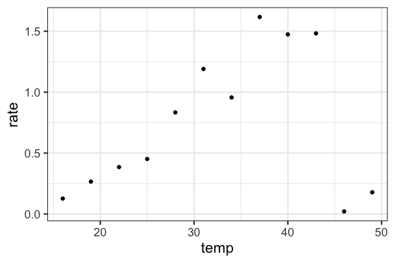
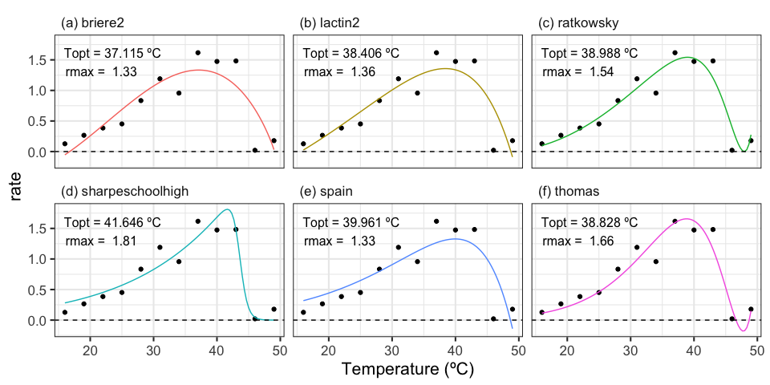
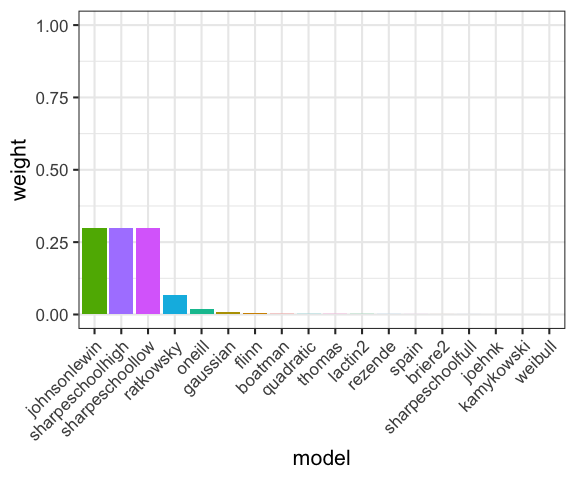
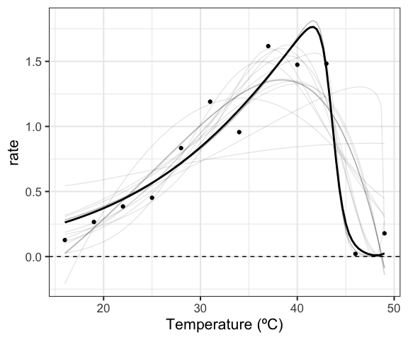
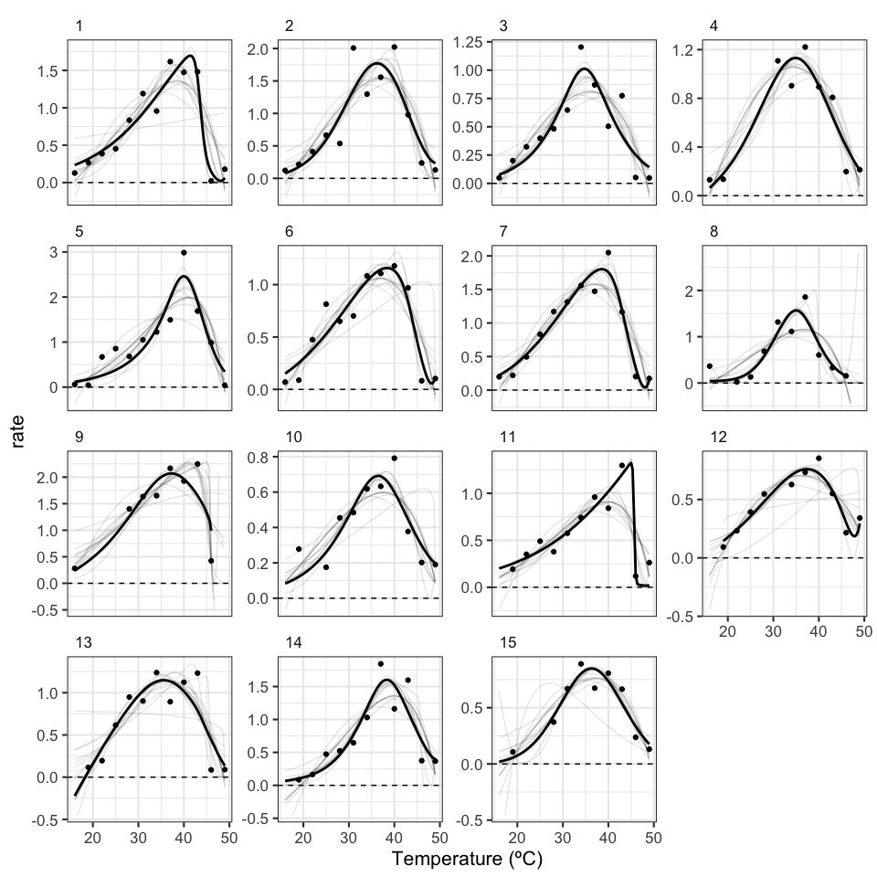
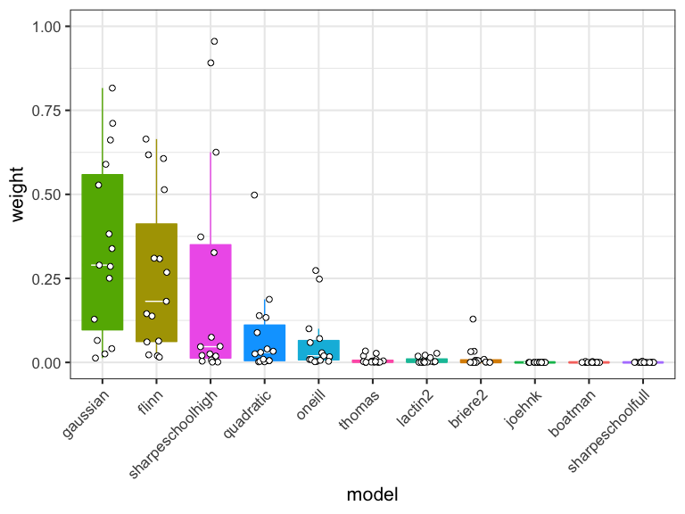

<!-- README.md is generated from README.Rmd. Please edit that file -->

# rTPC

The aim of rTPC is to help fit thermal performance in R. These functions
act as wrappers that aid in the fitting of common functions for fitting
thermal performance curves.

## Installation

``` r
# install package from GitHub
devtools::install_github("padpadpadpad/rTPC")
```

To show each function reported previously in the literature, we shall
fit the models using the `R` package `nls.multstart`. First, we shall
install other packages that will help in model fitting and plotting.

``` r
# install nls.multstart
install.packages('nls.multstart')
install.packages('purrr')
install.packages('dplyr')
install.packages('tidyr')
install.packages('ggplot2')
install.packages('nls.multstart')
install.packages('broom')
install.packages('MuMIn')
```

We can now load in the data and the packages to fit the TPCs. Here, we
shall use some TPCs of photosynthesis and respiration from Padfield *et
al.* (2016).

``` r
# load in packages
library(purrr)
library(dplyr)
library(tidyr)
library(ggplot2)
library(nls.multstart)
library(broom)
library(rTPC)
library(MuMIn)

# write function to label ggplot2 panels
label_facets_num <- function(string){
  len <- length(string)
  string = paste('(', 1:len, ') ', string, sep = '')
  return(string)
}

# write function to convert label text size to points
pts <- function(x){
  as.numeric(grid::convertX(grid::unit(x, 'points'), 'mm'))
}

# load in data
data("Chlorella_TRC")

# change rate to be non-log transformed
d <- mutate(Chlorella_TRC, rate = exp(ln.rate))

# filter for just the first curve
d_1 <- filter(d, curve_id == 1)

# plot
ggplot(d_1, aes(temp, rate)) +
  geom_point() +
  theme_bw(base_size = 16)
```



We can now run `nls.multstart::nls_multstart()` for each function.

``` r
# run in purrr - going to be a huge long command this one
d_models <- group_by(d_1, curve_id, growth.temp, process, flux) %>%
  nest() %>%
  mutate(., lactin2 = map(data, ~nls_multstart(rate ~ lactin2_1995(temp = temp, p, c, tmax, delta_t),
                       data = .x,
                       iter = 500,
                       start_lower = c(p = 0, c = -2, tmax = 35, delta_t = 0),
                       start_upper = c(p = 3, c = 0, tmax = 55, delta_t = 15),
                       supp_errors = 'Y')),
            sharpeschoolhigh = map(data, ~nls_multstart(rate ~ sharpeschoolhigh_1981(temp_k = K, r_tref, e, eh, th, tref = 15),
                                           data = .x,
                                           iter = 500,
                                           start_lower = c(r_tref = 0.01, e = 0, eh = 0, th = 270),
                                           start_upper = c(r_tref = 2, e = 3, eh = 10, th = 330),
                                           supp_errors = 'Y')),
            johnsonlewin = map(data, ~nls_multstart(rate ~ johnsonlewin_1946(temp_k = K, r0, e, eh, topt),
                                           data = .x,
                                           iter = 500,
                                           start_lower = c(r0 = 1e9, e = 0, eh = 0, topt = 270),
                                           start_upper = c(r0 = 1e11, e = 2, eh = 10, topt = 330),
                                           supp_errors = 'Y')),
            thomas = map(data, ~nls_multstart(rate ~ thomas_2012(temp = temp, a, b, c, topt),
                                           data = .x,
                                           iter = 500,
                                           start_lower = c(a = -10, b = -10, c = -10, topt = 0),
                                           start_upper = c(a = 10, b = 10, c = 10, topt = 40),
                                           supp_errors = 'Y',
                                           lower = c(a= 0, b = -10, c = 0, topt = 0))),
            briere2 = map(data, ~nls_multstart(rate ~ briere2_1999(temp = temp, tmin, tmax, a, b),
                                           data = .x,
                                           iter = 500,
                                           start_lower = c(tmin = 0, tmax = 20, a = -10, b = -10),
                                           start_upper = c(tmin = 20, tmax = 50, a = 10, b = 10),
                                           supp_errors = 'Y',
                                           lower = c(tmin = -10, tmax = 20, a = -10, b = -10),
                                           upper = c(tmin = 20, tmax = 80, a = 10, b = 10))),
            spain = map(data, ~nls_multstart(rate ~ spain_1982(temp = temp, a, b, c, r0),
                                           data = .x,
                                           iter = 500,
                                           start_lower = c(a = -1, b = -1, c = -1, r0 = -1),
                                           start_upper = c(a = 1, b = 1, c = 1, r0 = 1),
                                           supp_errors = 'Y')),
            ratkowsky = map(data, ~nls_multstart(rate ~ ratkowsky_1983(temp = temp, tmin, tmax, a, b),
                                           data = .x,
                                           iter = 500,
                                           start_lower = c(tmin = 0, tmax = 20, a = -10, b = -10),
                                           start_upper = c(tmin = 20, tmax = 50, a = 10, b = 10),
                                           supp_errors = 'Y')),
            boatman = map(data, ~nls_multstart(rate ~ boatman_2017(temp = temp, rmax, tmin, tmax, a, b),
                                           data = .x,
                                           iter = 500,
                                           start_lower = c(rmax = 0, tmin = 0, tmax = 35, a = -1, b = -1),
                                           start_upper = c(rmax = 2, tmin = 10, tmax = 50, a = 1, b = 1),
                                           supp_errors = 'Y')),
            flinn = map(data, ~nls_multstart(rate ~ flinn_1991(temp = temp, a, b, c),
                                           data = .x,
                                           iter = 500,
                                           start_lower = c(a = 0, b = -2, c = -1),
                                           start_upper = c(a = 30, b = 2, c = 1),
                                           supp_errors = 'Y')),
            gaussian = map(data, ~nls_multstart(rate ~ gaussian_1987(temp = temp, rmax, topt, a),
                                           data = .x,
                                           iter = 500,
                                           start_lower = c(rmax = 0, topt = 20, a = 0),
                                           start_upper = c(rmax = 2, topt = 40, a = 30),
                                           supp_errors = 'Y')),
            oneill = map(data, ~nls_multstart(rate ~ oneill_1972(temp = temp, rmax, tmax, topt, a),
                                           data = .x,
                                           iter = 500,
                                           start_lower = c(rmax = 1, tmax = 30, topt = 20, a = 1),
                                           start_upper = c(rmax = 2, tmax = 50, topt = 40, a = 2),
                                           supp_errors = 'Y')),
            joehnk = map(data, ~nls_multstart(rate ~ joehnk_2008(temp = temp, rmax, topt, a, b, c),
                                           data = .x,
                                           iter = 500,
                                           start_lower = c(rmax = 0, topt = 20, a = 0, b = 1, c = 1),
                                           start_upper = c(rmax = 2, topt = 40, a = 30, b = 2, c = 2),
                                           supp_errors = 'Y',
                                           lower = c(rmax = 0, topt = 0, a = 0, b = 1, c = 1))),
            kamykowski = map(data, ~nls_multstart(rate ~ kamykowski_1985(temp = temp, tmin, tmax, a, b, c),
                                           data = .x,
                                           iter = 500,
                                           start_lower = c(tmin = 0, tmax = 10, a = -3, b = -1, c = -1),
                                           start_upper = c(tmin = 20, tmax = 50, a = 3, b = 1, c =1),
                                           supp_errors = 'Y')),
            quadratic = map(data, ~nls_multstart(rate ~ quadratic_2008(temp = temp, a, b, c),
                                           data = .x,
                                           iter = 500,
                                           start_lower = c(a = 0, b = -2, c = -1),
                                           start_upper = c(a = 30, b = 2, c = 1),
                                           supp_errors = 'Y')),
            hinshelwood = map(data, ~nls_multstart(rate ~ hinshelwood_1947(temp = temp, a, e, c, eh),
                                           data = .x,
                                           iter = 500,
                                           start_lower = c(a = 1e9, e = 5, c = 1e9, eh = 0),
                                           start_upper = c(a = 1e11, e = 20, c = 1e11, eh = 20),
                                           supp_errors = 'Y')),
            sharpeschoolfull = map(data, ~nls_multstart(rate ~ sharpeschoolfull_1981(temp_k = K, r_tref, e, el, tl, eh, th, tref = 15),
                                           data = .x,
                                           iter = 500,
                                           start_lower = c(r_tref = 0.01, e = 0, el = 0, tl = 270, eh = 0, th = 270),
                                           start_upper = c(r_tref = 2, e = 3, el = 10, tl = 330, eh = 10, th = 330),
                                           supp_errors = 'Y')),
            sharpeschoollow = map(data, ~nls_multstart(rate ~ sharpeschoollow_1981(temp_k = K, r_tref, e, el, tl, tref = 15),
                                           data = .x,
                                           iter = 500,
                                           start_lower = c(r_tref = 0.01, e = 0, el = 0, tl = 270),
                                           start_upper = c(r_tref = 2, e = 3, el = 10, tl = 330),
                                           supp_errors = 'Y')),
            weibull = map(data, ~nls_multstart(rate ~ weibull_1995(temp = temp, a, topt, b, c),
                                           data = .x,
                                           iter = 500,
                                           start_lower = c(a = 0, topt = 30, b = 100, c = 10),
                                           start_upper = c(a = 3, topt = 50, b = 200, c = 50),
                                           lower = c(a = 0, topt = 20, b = 0, c = 0),
                                           supp_errors = 'Y')),
            rezende = map(data, ~nls_multstart(rate ~ rezende_2019(temp = temp, a, q10, b, c),
                                           data = .x,
                                           iter = 500,
                                           start_lower = c(a = 0, q10 = 1, b = 10, c = 0),
                                           start_upper = c(a = 1, q10 = 4, b = 50, c = 0.005),
                                           supp_errors = 'Y')))
```

Using tools from the `tidyverse`, we can now easily estimate predictions
of each model and plot them. In addition, we can estimate extra
parameters for each model using `est_params()`.

``` r
# stack models
d_stack <- gather(d_models, 'model', 'output', 6:ncol(d_models))

# preds
newdata <- tibble(temp = seq(min(d_1$temp), max(d_1$temp), length.out = 100),
                  K = seq(min(d_1$K), max(d_1$K), length.out = 100))
d_preds <- d_stack %>%
  unnest(., output %>% map(augment, newdata = newdata)) %>%
  mutate(., temp = ifelse(model == 'sharpeschoolhigh', K - 273.15, temp))

# estimate extra parameters
extra_params <- d_stack %>%
  mutate(., est = map(output, est_params)) %>%
  select(., -c(data, output)) %>%
  unnest(., est) %>%
  mutate(., topt = ifelse(topt > 200, topt - 273.15, topt),
         ctmin =ifelse(ctmin > 150, ctmin - 273.15, ctmin),
         ctmax =ifelse(ctmax > 200, ctmax - 273.15, ctmax),
         rmax = round(rmax, 2))
#> Warning in min(newdata_extrap[, param_ind], na.rm = TRUE): no non-missing
#> arguments to min; returning Inf
#> Warning in max(newdata_extrap[, param_ind], na.rm = TRUE): no non-missing
#> arguments to max; returning -Inf
#> Warning in min(newdata_extrap[, param_ind], na.rm = TRUE): no non-missing
#> arguments to min; returning Inf

# plot
ggplot(d_preds, aes(temp, rate)) +
  geom_point(aes(temp, rate), d_1) +
  geom_text(aes(-Inf, Inf, label = paste('Topt =', round(topt, 1), 'ºC\n', 'rmax = ', rmax, '\nctmin =', round(ctmin, 1), 'ºC\n', 'ctmax =', round(ctmax, 1), 'ºC', sep = '')),  hjust = -0.1, vjust = 1.15, extra_params, size = pts(9)) +
  geom_line(aes(temp, .fitted, col = model)) +
  facet_wrap(~model, labeller = labeller(model = label_facets_num)) +
  theme_bw(base_size = 16) +
  theme(legend.position = 'none',
        strip.text = element_text(hjust = 0),
        strip.background = element_blank()) +
  xlab('Temperature (ºC)') +
  ylab('rate') +
  geom_hline(aes(yintercept = 0), linetype = 2)
```



From these fits, we can also take advantage of model selection methods
such as the *AICc* score. We can calculate model weights of these to see
which model is most supported.

``` r

# calculate AICc score and weight models
d_stack <- mutate(d_stack, aic = map_dbl(output, possibly(MuMIn::AICc, NA))) %>%
  filter(., !is.na(aic)) %>%
  mutate(., weight = MuMIn::Weights(aic))

# plot weights
ggplot(d_stack, aes(forcats::fct_reorder(model, weight, .desc = TRUE), weight, fill = model)) +
  geom_col() +
  theme_bw(base_size = 16) +
  xlab('model') +
  theme(legend.position = 'element_blank',
        axis.text.x = element_text(angle = 45, hjust = 1)) +
  ylim(c(0,1)) 
```



We can then calculate model weighted predictions of best overall model
fit easily enough if desired.

``` r
# calculate average prediction
ave_preds <- merge(d_preds, select(d_stack, model, weight), by = 'model') %>%
  mutate(., temp = round(temp, 2)) %>%
  group_by(temp) %>%
  summarise(., ave_pred = sum(.fitted*weight)) %>%
  ungroup()

# plot these
ggplot() +
  geom_point(aes(temp, rate), d_1) +
  geom_line(aes(temp, .fitted, group = model), alpha = 0.1, d_preds) +
  geom_line(aes(temp, ave_pred), ave_preds, size = 1) +
  theme_bw(base_size = 16) +
  theme(legend.position = 'none',
        strip.text = element_text(hjust = 0),
        strip.background = element_blank()) +
  xlab('Temperature (ºC)') +
  ylab('rate') +
  geom_hline(aes(yintercept = 0), linetype = 2)
```



The amazing thing about this method is that it can easily be implement
on many different curves. For example we can fit this model ensemble to
each of 15 curves from the dataset, calculate the *AICc* for each one
and then plot the model averaged curve.

``` r
# filter 15 curves
d_15 <- filter(d, curve_id <= 15)

# run each model on each curve
# run in purrr - going to be a huge long command this one
d_models <- group_by(d_15, curve_id, growth.temp, process, flux) %>%
  nest() %>%
  mutate(., lactin2 = map(data, ~nls_multstart(rate ~ lactin2_1995(temp = temp, p, c, tmax, delta_t),
                       data = .x,
                       iter = 500,
                       start_lower = c(p = 0, c = -2, tmax = 35, delta_t = 0),
                       start_upper = c(p = 3, c = 0, tmax = 55, delta_t = 15),
                       supp_errors = 'Y')),
            sharpeschoolhigh = map(data, ~nls_multstart(rate ~ sharpeschoolhigh_1981(temp_k = K, r_tref, e, eh, th, tref = 15),
                       data = .x,
                       iter = 500,
                       start_lower = c(r_tref = 0.01, e = 0, eh = 0, th = 270),
                       start_upper = c(r_tref = 2, e = 3, eh = 10, th = 330),
                       supp_errors = 'Y')),
            thomas = map(data, ~nls_multstart(rate ~ thomas_2012(temp = temp, a, b, c, topt),
                       data = .x,
                       iter = 500,
                       start_lower = c(a = -10, b = -10, c = -10, topt = 0),
                       start_upper = c(a = 10, b = 10, c = 10, topt = 40),
                       supp_errors = 'Y',
                       lower = c(a= 0, b = -10, c = 0, topt = 0))),
            briere2 = map(data, ~nls_multstart(rate ~ briere2_1999(temp = temp, tmin, tmax, a, b),
                       data = .x,
                       iter = 500,
                       start_lower = c(tmin = 0, tmax = 20, a = -10, b = -10),
                       start_upper = c(tmin = 20, tmax = 50, a = 10, b = 10),
                       supp_errors = 'Y',
                       lower = c(tmin = -10, tmax = 20, a = -10, b = -10),
                       upper = c(tmin = 20, tmax = 80, a = 10, b = 10))),
            spain = map(data, ~nls_multstart(rate ~ spain_1982(temp = temp, a, b, c, r0),
                       data = .x,
                       iter = 500,
                       start_lower = c(a = -1, b = -1, c = -1, r0 = -1),
                       start_upper = c(a = 1, b = 1, c = 1, r0 = 1),
                       supp_errors = 'Y')),
            ratkowsky = map(data, ~nls_multstart(rate ~ ratkowsky_1983(temp = temp, tmin, tmax, a, b),
                       data = .x,
                       iter = 500,
                       start_lower = c(tmin = 0, tmax = 20, a = -10, b = -10),
                       start_upper = c(tmin = 20, tmax = 50, a = 10, b = 10),
                       supp_errors = 'Y')),
         boatman = map(data, ~nls_multstart(rate ~ boatman_2017(temp = temp, rmax, tmin, tmax, a, b),
                        data = .x,
                        iter = 500,
                        start_lower = c(rmax = 0, tmin = 0, tmax = 35, a = -1, b = -1),
                        start_upper = c(rmax = 2, tmin = 10, tmax = 50, a = 1, b = 1),
                        supp_errors = 'Y')),
         flinn = map(data, ~nls_multstart(rate ~ flinn_1991(temp = temp, a, b, c),
                        data = .x,
                        iter = 500,
                        start_lower = c(a = 0, b = -2, c = -1),
                        start_upper = c(a = 30, b = 2, c = 1),
                        supp_errors = 'Y')),
         gaussian = map(data, ~nls_multstart(rate ~ gaussian_1987(temp = temp, rmax, topt, a),
                        data = .x,
                        iter = 500,
                        start_lower = c(rmax = 0, topt = 20, a = 0),
                        start_upper = c(rmax = 2, topt = 40, a = 30),
                        supp_errors = 'Y')),
         oneill = map(data, ~nls_multstart(rate ~ oneill_1972(temp = temp, rmax, tmax, topt, a),
                        data = .x,
                        iter = 500,
                        start_lower = c(rmax = 1, tmax = 30, topt = 20, a = 1),
                        start_upper = c(rmax = 2, tmax = 50, topt = 40, a = 2),
                        supp_errors = 'Y')),
         joehnk = map(data, ~nls_multstart(rate ~ joehnk_2008(temp = temp, rmax, topt, a, b, c),
                        data = .x,
                        iter = 500,
                        start_lower = c(rmax = 0, topt = 20, a = 0, b = 1, c = 1),
                        start_upper = c(rmax = 2, topt = 40, a = 30, b = 2, c = 2),
                        supp_errors = 'Y',
                        lower = c(rmax = 0, topt = 0, a = 0, b = 1, c = 1))),
         kamykowski = map(data, ~nls_multstart(rate ~ kamykowski_1985(temp = temp, tmin, tmax, a, b, c),
                        data = .x,
                        iter = 500,
                        start_lower = c(tmin = 0, tmax = 10, a = -3, b = -1, c = -1),
                        start_upper = c(tmin = 20, tmax = 50, a = 3, b = 1, c =1),
                        supp_errors = 'Y')),
         quadratic = map(data, ~nls_multstart(rate ~ quadratic_2008(temp = temp, a, b, c),
                        data = .x,
                        iter = 500,
                        start_lower = c(a = 0, b = -2, c = -1),
                        start_upper = c(a = 30, b = 2, c = 1),
                        supp_errors = 'Y')),
         hinshelwood = map(data, ~nls_multstart(rate ~ hinshelwood_1947(temp = temp, a, e, c, eh),
                        data = .x,
                        iter = 500,
                        start_lower = c(a = 1e9, e = 5, c = 1e9, eh = 0),
                        start_upper = c(a = 1e11, e = 20, c = 1e11, eh = 20),
                        supp_errors = 'Y')),
         sharpeschoolfull = map(data, ~nls_multstart(rate ~ sharpeschoolfull_1981(temp_k = K, r_tref, e, el, tl, eh, th, tref = 15),
                        data = .x,
                        iter = 500,
                        start_lower = c(r_tref = 0.01, e = 0, el = 0, tl = 270, eh = 0, th = 270),
                        start_upper = c(r_tref = 2, e = 3, el = 10, tl = 330, eh = 10, th = 330),
                        supp_errors = 'Y')),
         sharpeschoollow = map(data, ~nls_multstart(rate ~ sharpeschoollow_1981(temp_k = K, r_tref, e, el, tl, tref = 15),
                        data = .x,
                        iter = 500,
                        start_lower = c(r_tref = 0.01, e = 0, el = 0, tl = 270),
                        start_upper = c(r_tref = 2, e = 3, el = 10, tl = 330),
                        supp_errors = 'Y')))

# stack models
d_stack <- gather(d_models, 'model', 'output', 6:ncol(d_models))

# preds
newdata <- tibble(temp = seq(min(d_1$temp), max(d_1$temp), length.out = 100),
                  K = seq(min(d_1$K), max(d_1$K), length.out = 100))
d_preds <- d_stack %>%
  unnest(., output %>% map(augment, newdata = newdata)) %>%
  mutate(., temp = ifelse(model == 'sharpeschoolhigh', K - 273.15, temp))

# calculate AICc score and weight models
d_stack <- mutate(d_stack, aic = map_dbl(output, possibly(MuMIn::AICc, NA))) %>%
  filter(., !is.na(aic)) %>%
  group_by(curve_id) %>%
  mutate(., weight = MuMIn::Weights(aic))

# calculate average predictions
ave_preds <- merge(d_preds, select(d_stack, model, weight, curve_id), by = c('model', 'curve_id')) %>%
  mutate(., temp = round(temp, 2)) %>%
  group_by(temp, curve_id) %>%
  summarise(., ave_pred = sum(.fitted*weight)) %>%
  ungroup()
```

We can then make the exact plots as we made previously. Firstly of the
predictions of each curve.

``` r
lines <- data.frame(val = 0, curve_id = 1:15)

ggplot() +
  geom_point(aes(temp, rate), d_15) +
  geom_line(aes(temp, .fitted, group = model), alpha = 0.1, filter(d_preds, .fitted > -0.5 & .fitted < 3)) +
  geom_line(aes(temp, ave_pred), ave_preds, size = 1) +
  facet_wrap(~ curve_id, scales = 'free_y') +
  theme_bw(base_size = 16) +
  theme(legend.position = 'none',
        strip.text = element_text(hjust = 0),
        strip.background = element_blank()) +
  xlab('Temperature (ºC)') +
  ylab('rate') +
  geom_hline(aes(yintercept = val), linetype = 2, lines)
```



We can also plot the distribution of the weights across all of the
curves.

``` r
ggplot(d_stack, aes(forcats::fct_reorder(model, weight, .desc = TRUE), weight)) +
  MicrobioUoE::geom_pretty_boxplot(aes(fill = model, col = model)) +
  geom_point(shape = 21, fill = 'white', position = position_jitter(width = 0.2), size = 2) +
  theme_bw(base_size = 16) +
  xlab('model') +
  theme(legend.position = 'element_blank',
        axis.text.x = element_text(angle = 45, hjust = 1)) +
  ylim(c(0,1)) 
#> Warning in sample.int(.Machine$integer.max, 1L): '.Random.seed[1]' is not a
#> valid integer, so ignored
```


