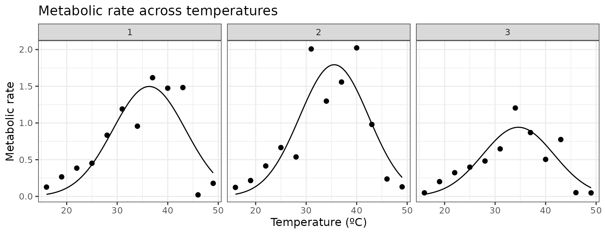
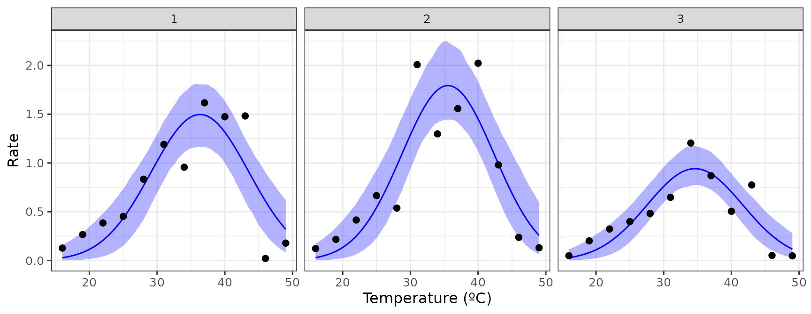
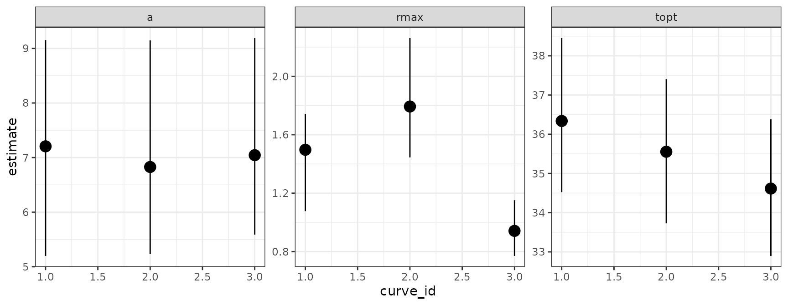
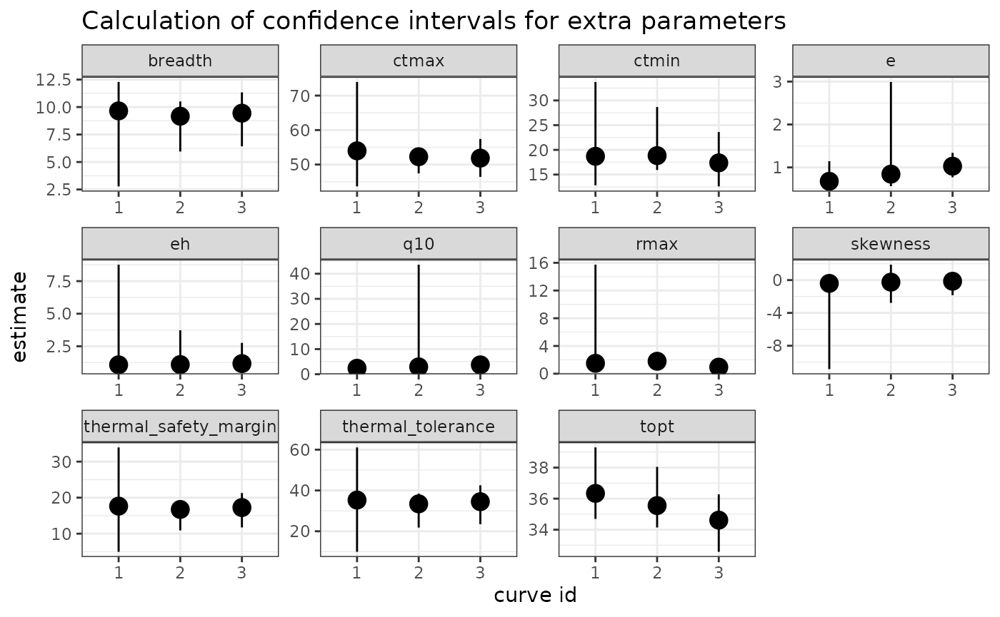

# Bootstrapping many curves using rTPC

#### A brief example of how many curves can be bootstrapped when fitting models to TPCs using rTPC, nls.multstart, car and the tidyverse.

------------------------------------------------------------------------

## Things to consider

- For a comprehensive run-through of the types of bootstrapping that can
  be done within the *rTPC* workflow, please see
  [`vignette("bootstrapping_models")`](https://padpadpadpad.github.io/rTPC/articles/bootstrapping_models.md)
- This vignette is written as an example of how to run your chosen
  bootstrapping method on multiple models

------------------------------------------------------------------------

``` r
# load packages
library(boot)
library(car)
library(rTPC)
library(nls.multstart)
library(broom)
library(tidyverse)
library(patchwork)
library(minpack.lm)
```

## The problem

This vignette is inspired by an email I got from someone who was
struggling to implement the bootstrapping approach using the package
**car** on multiple curves. First I will demonstrate how the approach
would be done using the approach of using the **tidyverse** and **car**,
and how it breaks. I will fit the
[`gaussian_1987()`](https://padpadpadpad.github.io/rTPC/reference/gaussian_1987.md)
model to the first three curves of the `chlorella_tpc` dataset.

``` r
# load in data
data("chlorella_tpc")

# keep just a single curve
d <- filter(chlorella_tpc, curve_id <= 3)

# fit
d_fits <- nest(d, data = c(rate, temp)) %>%
  mutate(
    gaussian = map(
      data,
      ~ nls_multstart(
        rate ~ gaussian_1987(temp, rmax, topt, a),
        data = .x,
        iter = c(3, 3, 3),
        start_lower = get_start_vals(
          .x$temp,
          .x$rate,
          model_name = 'gaussian_1987'
        ) -
          1,
        start_upper = get_start_vals(
          .x$temp,
          .x$rate,
          model_name = 'gaussian_1987'
        ) +
          1,
        lower = get_lower_lims(.x$temp, .x$rate, model_name = 'gaussian_1987'),
        upper = get_upper_lims(.x$temp, .x$rate, model_name = 'gaussian_1987'),
        supp_errors = 'Y',
        convergence_count = FALSE
      )
    )
  )

# create high resolution predictions
d_preds <- mutate(
  d_fits,
  new_data = map(
    data,
    ~ tibble(temp = seq(min(.x$temp), max(.x$temp), length.out = 100))
  )
) %>%
  select(., -data) %>%
  mutate(preds = map2(gaussian, new_data, ~ augment(.x, newdata = .y))) %>%
  select(curve_id, growth_temp, process, flux, preds) %>%
  unnest(preds)

# show the data
ggplot(d, aes(temp, rate)) +
  geom_point(size = 2) +
  geom_line(aes(temp, .fitted), d_preds) +
  theme_bw(base_size = 12) +
  labs(
    x = 'Temperature (ºC)',
    y = 'Metabolic rate',
    title = 'Metabolic rate across temperatures'
  ) +
  facet_wrap(~curve_id)
```



Using the pipeline used previously, we would extract the coefficients of
each model, fun **minpack.lm::nlsLM()** on each one and then run
**car::Boot()**. However, this time the output of
**minpack.lm::nlsLM()** and **car::Boot()** need to be stored in the
list column within `d_fits`.

Extracting the coefficients and refitting the models using
**minpack.lm::nlsLM()** works fine.

``` r
# get coefs
d_fits <- mutate(d_fits, coefs = map(gaussian, coef))

# fit with nlsLM instead
d_fits <- mutate(
  d_fits,
  nls_fit = map2(
    data,
    coefs,
    ~ nlsLM(
      rate ~ gaussian_1987(temp, rmax, topt, a),
      data = .x,
      start = .y,
      lower = get_lower_lims(.x$temp, .x$rate, model_name = 'gaussian_1987'),
      upper = get_upper_lims(.x$temp, .x$rate, model_name = 'gaussian_1987')
    )
  )
)

head(d_fits)
#> # A tibble: 3 × 8
#>   curve_id growth_temp process     flux        data     gaussian coefs  nls_fit
#>      <dbl>       <dbl> <chr>       <chr>       <list>   <list>   <list> <list> 
#> 1        1          20 acclimation respiration <tibble> <nls>    <dbl>  <nls>  
#> 2        2          20 acclimation respiration <tibble> <nls>    <dbl>  <nls>  
#> 3        3          23 acclimation respiration <tibble> <nls>    <dbl>  <nls>

d_fits$nls_fit[[1]]
#> Nonlinear regression model
#>   model: rate ~ gaussian_1987(temp, rmax, topt, a)
#>    data: .x
#>   rmax   topt      a 
#>  1.497 36.338  7.206 
#>  residual sum-of-squares: 0.961
#> 
#> Number of iterations to convergence: 1 
#> Achieved convergence tolerance: 1.49e-08
```

However, using **car::Boot()** currently gives an error.

``` r
# try and bootstrap # THIS BREAKS
d_fits <- mutate(
  d_fits,
  bootstrap = map(nls_fit, ~ Boot(.x, method = 'residual'))
)
#> Error in `mutate()`:
#> ℹ In argument: `bootstrap = map(nls_fit, ~Boot(.x, method =
#>   "residual"))`.
#> Caused by error in `map()`:
#> ℹ In index: 1.
#> Caused by error:
#> ! object '.x' not found
```

The error, that the object `.x` cannot be found, likely means that
**car::Boot()** is incompatible with the **purrr::map()** method of
using list columns to store model objects and get predictions and
parameter estimates. Usually I would email the creators and maintainers
of **car**, but having already emailed them multiple times with code
problems/queries when trying to get **car::Boot()** to work with
non-linear least squares regressions, I decided to try find a
not-so-painful workaround.

## The solution

Instead of creating a list column with **mutate()** and **map()**, we
can create an empty list column and then run a for loop to run
**Boot()** on each model in the list column of the dataframe. We can
then just place that result of **Boot()** into the right place of our
empty list column. Because the error comes from the actual model fit, we
need to run the **nlsLM()** model again each time. I really like this
approach and have found it powerful numerous times now.

``` r
# create empty list column
d_fits <- mutate(d_fits, bootstrap = list(rep(NA, n())))

# run for loop to bootstrap each refitted model
for (i in 1:nrow(d_fits)) {
  temp_data <- d_fits$data[[i]]
  temp_fit <- nlsLM(
    rate ~ gaussian_1987(temp, rmax, topt, a),
    data = temp_data,
    start = d_fits$coefs[[i]],
    lower = get_lower_lims(
      temp_data$temp,
      temp_data$rate,
      model_name = 'gaussian_1987'
    ),
    upper = get_upper_lims(
      temp_data$temp,
      temp_data$rate,
      model_name = 'gaussian_1987'
    )
  )
  boot <- Boot(temp_fit, method = 'residual')
  d_fits$bootstrap[[i]] <- boot
  rm(list = c('temp_fit', 'temp_data', 'boot'))
}

d_fits
#> # A tibble: 3 × 9
#>   curve_id growth_temp process   flux  data     gaussian coefs nls_fit bootstrap
#>      <dbl>       <dbl> <chr>     <chr> <list>   <list>   <lis> <list>  <list>   
#> 1        1          20 acclimat… resp… <tibble> <nls>    <dbl> <nls>   <boot>   
#> 2        2          20 acclimat… resp… <tibble> <nls>    <dbl> <nls>   <boot>   
#> 3        3          23 acclimat… resp… <tibble> <nls>    <dbl> <nls>   <boot>
```

Voila! There is now a list column of the bootstrapped parameter
estimates for each model.

It is now possible to do all the other things in the pipeline. Firstly,
we can get the 95% confidence intervals around our predictions. This
heavily borrows from the code from
[`vignette("bootstrapping_models")`](https://padpadpadpad.github.io/rTPC/articles/bootstrapping_models.md),
but is a little more laborious as we are applying it to a list column.
The function defined is not the prettiest but it does exactly the same
job as in
[`vignette("bootstrapping_models")`](https://padpadpadpad.github.io/rTPC/articles/bootstrapping_models.md).

``` r
# get the raw values of each bootstrap
d_fits <- mutate(d_fits, output_boot = map(bootstrap, function(x) x$t))

# calculate predictions with a gnarly written function
d_fits <- mutate(
  d_fits,
  preds = map2(output_boot, data, function(x, y) {
    temp <- as.data.frame(x) %>%
      drop_na() %>%
      mutate(iter = 1:n()) %>%
      group_by_all() %>%
      do(data.frame(temp = seq(min(y$temp), max(y$temp), length.out = 100))) %>%
      ungroup() %>%
      mutate(pred = gaussian_1987(temp, rmax, topt, a))
    return(temp)
  })
)

# select, unnest and calculate 95% CIs of predictions
boot_conf_preds <- select(d_fits, curve_id, preds) %>%
  unnest(preds) %>%
  group_by(curve_id, temp) %>%
  summarise(
    conf_lower = quantile(pred, 0.025),
    conf_upper = quantile(pred, 0.975),
    .groups = 'drop'
  )

ggplot() +
  geom_line(aes(temp, .fitted), d_preds, col = 'blue') +
  geom_ribbon(
    aes(temp, ymin = conf_lower, ymax = conf_upper),
    boot_conf_preds,
    fill = 'blue',
    alpha = 0.3
  ) +
  geom_point(aes(temp, rate), d, size = 2) +
  theme_bw(base_size = 12) +
  labs(x = 'Temperature (ºC)', y = 'Rate') +
  facet_wrap(~curve_id)
```



Second, we can calculate the confidence intervals of the estimated
parameters explicitly modelled in the regression.

``` r
# get tidied parameters using broom::tidy
# get confidence intervals of parameters
d_fits <- mutate(
  d_fits,
  params = map(nls_fit, broom::tidy),
  cis = map(bootstrap, function(x) {
    temp <- confint(x, method = 'bca') %>%
      as.data.frame() %>%
      rename(conf_lower = 1, conf_upper = 2) %>%
      rownames_to_column(., var = 'term')
    return(temp)
  })
)

# join parameter and confidence intervals in the same dataset
left_join(
  select(d_fits, curve_id, growth_temp, flux, params) %>% unnest(params),
  select(d_fits, curve_id, growth_temp, flux, cis) %>% unnest(cis)
) %>%
  ggplot(., aes(curve_id, estimate)) +
  geom_point(size = 4) +
  geom_linerange(aes(ymin = conf_lower, ymax = conf_upper)) +
  theme_bw() +
  facet_wrap(~term, scales = 'free')
#> Joining with `by = join_by(curve_id, growth_temp, flux, term)`
```



Finally, we can redo our **car::Boot()** procedure, but this time use
**calc_params()** to bootstrap confidence intervals for the extra
parameters such as \\T\_{opt}\\ and \\r\_{max}\\. For reasons that I
currently do not understand, **Boot()** and **calc_params()** only
calculates the activation energy, deactivation energy, and q10 when
using `method = case` not `method = residual`, but actually it is not
recommended to bootstrap these parameters from models where they are not
explicitly included in the model formula anyway.

``` r
# create empty list column
d_fits <- mutate(d_fits, ci_extra_params = list(rep(NA, n())))

# run for loop to bootstrap extra params from each model
for (i in 1:nrow(d_fits)) {
  temp_data <- d_fits$data[[i]]
  temp_fit <- nlsLM(
    rate ~ gaussian_1987(temp, rmax, topt, a),
    data = temp_data,
    start = d_fits$coefs[[i]],
    lower = get_lower_lims(
      temp_data$temp,
      temp_data$rate,
      model_name = 'gaussian_1987'
    ),
    upper = get_upper_lims(
      temp_data$temp,
      temp_data$rate,
      model_name = 'gaussian_1987'
    )
  )
  boot <- Boot(
    temp_fit,
    f = function(x) {
      unlist(calc_params(x))
    },
    labels = names(calc_params(temp_fit)),
    R = 20,
    method = 'case'
  ) %>%
    confint(., method = 'bca') %>%
    as.data.frame() %>%
    rename(conf_lower = 1, conf_upper = 2) %>%
    rownames_to_column(., var = 'param')
  d_fits$ci_extra_params[[i]] <- boot
  rm(list = c('temp_fit', 'temp_data', 'boot'))
}
#> 
#>  Number of bootstraps was 16 out of 20 attempted
#> 
#>  Number of bootstraps was 15 out of 20 attempted
#> 
#>  Number of bootstraps was 14 out of 20 attempted

# calculate extra params for each model and put in long format to begin with
d_fits <- mutate(
  d_fits,
  extra_params = map(nls_fit, function(x) {
    calc_params(x) %>%
      pivot_longer(everything(), names_to = 'param', values_to = 'estimate')
  })
)

left_join(
  select(d_fits, curve_id, growth_temp, flux, extra_params) %>%
    unnest(extra_params),
  select(d_fits, curve_id, growth_temp, flux, ci_extra_params) %>%
    unnest(ci_extra_params)
) %>%
  ggplot(., aes(as.character(curve_id), estimate)) +
  geom_point(size = 4) +
  geom_linerange(aes(ymin = conf_lower, ymax = conf_upper)) +
  theme_bw() +
  labs(y = 'estimate', x = "curve id") +
  facet_wrap(~param, scales = 'free') +
  labs(title = 'Calculation of confidence intervals for extra parameters')
#> Joining with `by = join_by(curve_id, growth_temp, flux, param)`
```



## Further reading

- John Fox (author of car) on bootstrapping regression models in R
  - <https://artowen.su.domains/courses/305a/FoxOnBootingRegInR.pdf>
- A.C. Davison & D.V. Hinkley (2003) Bootstrap Methods and their
  Application.
  - <https://doi.org/10.1017/CBO9780511802843>
- Schenker, N., & Gentleman, J. F. (2001). On judging the significance
  of differences by examining the overlap between confidence intervals.
  The American Statistician, 55(3), 182-186.
- Puth, M. T., Neuhäuser, M., & Ruxton, G. D. (2015). On the variety of
  methods for calculating confidence intervals by bootstrapping. Journal
  of Animal Ecology, 84(4), 892-897.

Built in 16.4809084s
