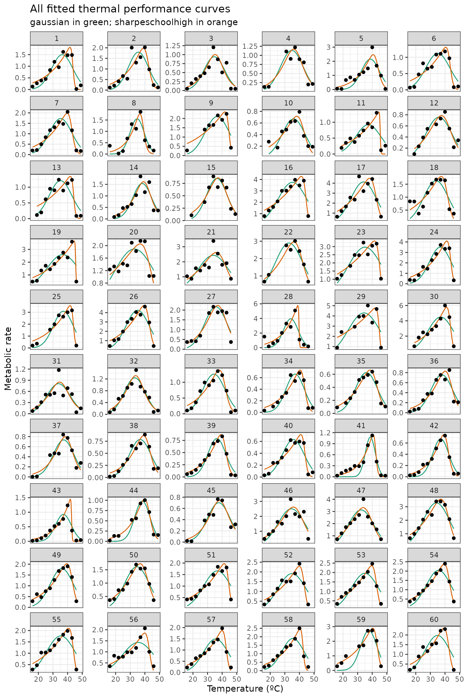

# Fitting many curves using rTPC

#### A brief example of how to fit many models to multiple TPCs using rTPC, nls.multstart and the tidyverse.

------------------------------------------------------------------------

## Things to consider

- Go through all the other **Things to consider** sections in the other
  vignettes.
- Think carefully about how to do model selection on the whole dataset.
- If you care about specific parameters (e.g. optimum temperature or
  activation energy) then you might want to pick a single “best” model
  for the whole dataset.
- If you care about the overall fit and its shape, then you might want
  to do pick a “best” model on each individual curve.
- You should read resources about model selection to inform your
  decisions.

------------------------------------------------------------------------

``` r
# load packages
library(rTPC)
library(nls.multstart)
library(broom)
library(tidyverse)
```

In the final part of the general pipeline, we demonstrate how multiple
models can be fitted to multiple TPCs. Instead of picking all 49 model
formulations to demonstrate this approach, we will use only 2 models in
this example: **gaussian_1987()** and **sharpeschoolhigh_1981()**.

We can demonstrate the fitting of multiple curves by modelling all 60
TPCs from the example dataset of **rTPC** curve from the example dataset
**rTPC**. These TPCs are of respiration and photosynthesis of the
aquatic algae, *Chlorella vulgaris*. These algae differed in their
growth temperature, `growth_temp`, and how long they had been grown at
that temperature, `process`, either for ~100 or ~10 generations.

Using a similar approach to
[`vignette('fit_many_models')`](https://padpadpadpad.github.io/rTPC/articles/fit_many_models.md),
models can be fitted to each curve using list columns and
**purrr::map()** to fit and store multiple models in a data frame.

When fitting lots of models at once, it is useful to know the progress
the code as it may take a long time to run.The R package **purrr** now
has progress bars built in; you can add a progress bar to the **map()**
function using the argument *.progress*. To make this work, we need to
only do a single **map()** call, so we will write a function that fits
both models that we will then pass to **purrr**. This is how we
*strongly* recommend fitting multiple models using **map()**.

``` r
# load in data
data("chlorella_tpc")
d <- chlorella_tpc

# write function to fit both models
fit_TPCs <- function(d, ...) {
  # get start values and fit gaussian
  start_vals <- rTPC::get_start_vals(
    d$temp,
    d$rate,
    model_name = 'gaussian_1987'
  )

  mod_gaussian <- nls.multstart::nls_multstart(
    rate ~ rTPC::gaussian_1987(temp = temp, rmax, topt, a),
    data = d,
    iter = c(4, 4, 4),
    start_lower = start_vals - 10,
    start_upper = start_vals + 10,
    lower = rTPC::get_lower_lims(d$temp, d$rate, model_name = 'gaussian_1987'),
    upper = rTPC::get_upper_lims(d$temp, d$rate, model_name = 'gaussian_1987'),
    supp_errors = 'Y',
    convergence_count = FALSE,
    ...
  )

  # get start values and fit sharpe schoolfield
  start_vals <- rTPC::get_start_vals(
    d$temp,
    d$rate,
    model_name = 'sharpeschoolhigh_1981'
  )

  # fit model
  mod_ss <- nls.multstart::nls_multstart(
    rate ~
      rTPC::sharpeschoolhigh_1981(temp = temp, r_tref, e, eh, th, tref = 20),
    data = d,
    iter = c(3, 3, 3, 3),
    start_lower = start_vals - 10,
    start_upper = start_vals + 10,
    lower = rTPC::get_lower_lims(
      d$temp,
      d$rate,
      model_name = 'sharpeschoolhigh_1981'
    ),
    upper = rTPC::get_upper_lims(
      d$temp,
      d$rate,
      model_name = 'sharpeschoolhigh_1981'
    ),
    supp_errors = 'Y',
    convergence_count = FALSE,
    ...
  )
  
  return(tibble::tibble(
    gaussian = list(mod_gaussian),
    sharpeschoolhigh = list(mod_ss)
  ))
}

# fit two chosen model formulation in rTPC
d_fits <- nest(d, data = c(temp, rate)) %>%
  mutate(
    mods = map(
      data,
      ~ fit_TPCs(d = .x),
      .progress = TRUE
    )
  ) %>%
  unnest(mods)
```

    #> ██████████████████████████████ 100% | ETA: 0s

Like previous vignettes, the predictions of each model can be estimated
using **broom::augment()**. To do this, we first create a new list
column containing high resolution temperature values by taking the `min`
and `max` of each curve. Next we stack the models and finally we get the
new predictions using the **map2()**, which allows us to use both `fit`
and `new_data` list columns. After unnesting the `preds` column, we are
then left with high resolution predictions for each curve. As this code
covers a lot of steps, each line of the code is commented.

``` r
# create new list column of for high resolution data
d_preds <- mutate(d_fits, new_data = map(data, ~tibble(temp = seq(min(.x$temp), max(.x$temp), length.out = 100)))) %>%
  # get rid of original data column
  select(., -data) %>%
  # stack models into a single column, with an id column for model_name
  pivot_longer(., names_to = 'model_name', values_to = 'fit', c(gaussian,sharpeschoolhigh)) %>%
  # create new list column containing the predictions
  # this uses both fit and new_data list columns
  mutate(preds = map2(fit, new_data, ~augment(.x, newdata = .y))) %>%
  # select only the columns we want to keep
  select(curve_id, growth_temp, process, flux, model_name, preds) %>%
  # unlist the preds list column
  unnest(preds)

glimpse(d_preds)
#> Rows: 12,000
#> Columns: 7
#> $ curve_id    <dbl> 1, 1, 1, 1, 1, 1, 1, 1, 1, 1, 1, 1, 1, 1, 1, 1, 1, 1, 1, 1…
#> $ growth_temp <dbl> 20, 20, 20, 20, 20, 20, 20, 20, 20, 20, 20, 20, 20, 20, 20…
#> $ process     <chr> "acclimation", "acclimation", "acclimation", "acclimation"…
#> $ flux        <chr> "respiration", "respiration", "respiration", "respiration"…
#> $ model_name  <chr> "gaussian", "gaussian", "gaussian", "gaussian", "gaussian"…
#> $ temp        <dbl> 16.00000, 16.33333, 16.66667, 17.00000, 17.33333, 17.66667…
#> $ .fitted     <dbl> 0.02790076, 0.03175769, 0.03607053, 0.04088150, 0.04623512…
```

We can then plot the predictions of each curve using **ggplot2**.

``` r
# plot
ggplot(d_preds) +
  geom_line(aes(temp, .fitted, col = model_name)) +
  geom_point(aes(temp, rate), d) +
  facet_wrap(~curve_id, scales = 'free_y', ncol = 6) +
  theme_bw() +
  theme(legend.position = 'none') +
  scale_color_brewer(type = 'qual', palette = 2) +
  labs(x = 'Temperature (ºC)',
       y = 'Metabolic rate',
       title = 'All fitted thermal performance curves',
       subtitle = 'gaussian in green; sharpeschoolhigh in orange')
```



The traits of each thermal performance curve can also easily be
calculated.

``` r
# stack models and calculate extra params
d_params <- pivot_longer(d_fits, names_to = 'model_name', values_to = 'fit', c(gaussian,sharpeschoolhigh)) %>%
  mutate(params = map(fit, calc_params, .progress = TRUE)) %>%
  select(curve_id, growth_temp, process, flux, model_name, params) %>%
  unnest(params)
#>  ■■■■■■■■                          24% |  ETA: 12s
#>  ■■■■■■■■■■■■■■                    44% |  ETA:  9s
#>  ■■■■■■■■■■■■■■■■■■■■              63% |  ETA:  6s
#>  ■■■■■■■■■■■■■■■■■■■■■■■■■■        83% |  ETA:  3s

glimpse(d_params)
#> Rows: 120
#> Columns: 16
#> $ curve_id              <dbl> 1, 1, 2, 2, 3, 3, 4, 4, 5, 5, 6, 6, 7, 7, 8, 8, …
#> $ growth_temp           <dbl> 20, 20, 20, 20, 23, 23, 27, 27, 27, 27, 30, 30, …
#> $ process               <chr> "acclimation", "acclimation", "acclimation", "ac…
#> $ flux                  <chr> "respiration", "respiration", "respiration", "re…
#> $ model_name            <chr> "gaussian", "sharpeschoolhigh", "gaussian", "sha…
#> $ rmax                  <dbl> 1.4972473, 1.8127063, 1.7935416, 1.9798352, 0.94…
#> $ topt                  <dbl> 36.338, 41.646, 35.554, 39.007, 34.615, 35.170, …
#> $ ctmin                 <dbl> 18.695, 2.539, 18.835, 6.086, 17.368, 11.970, 15…
#> $ ctmax                 <dbl> 53.981, 45.558, 52.272, 47.680, 51.861, 53.064, …
#> $ e                     <dbl> 0.6758954, 0.5802496, 0.8427748, 0.6621701, 1.02…
#> $ eh                    <dbl> 1.0767824, 11.4840311, 1.0954099, 2.4774826, 1.1…
#> $ q10                   <dbl> 2.373766, 2.063147, 2.927011, 2.305129, 3.722119…
#> $ thermal_safety_margin <dbl> 17.643, 3.912, 16.718, 8.673, 17.246, 17.894, 18…
#> $ thermal_tolerance     <dbl> 35.286, 43.019, 33.437, 41.594, 34.493, 41.094, …
#> $ breadth               <dbl> 9.651, 5.371, 9.165, 6.495, 9.442, 7.714, 10.354…
#> $ skewness              <dbl> -4.008871e-01, -1.090378e+01, -2.526351e-01, -1.…
```

Built in 40.921567s
