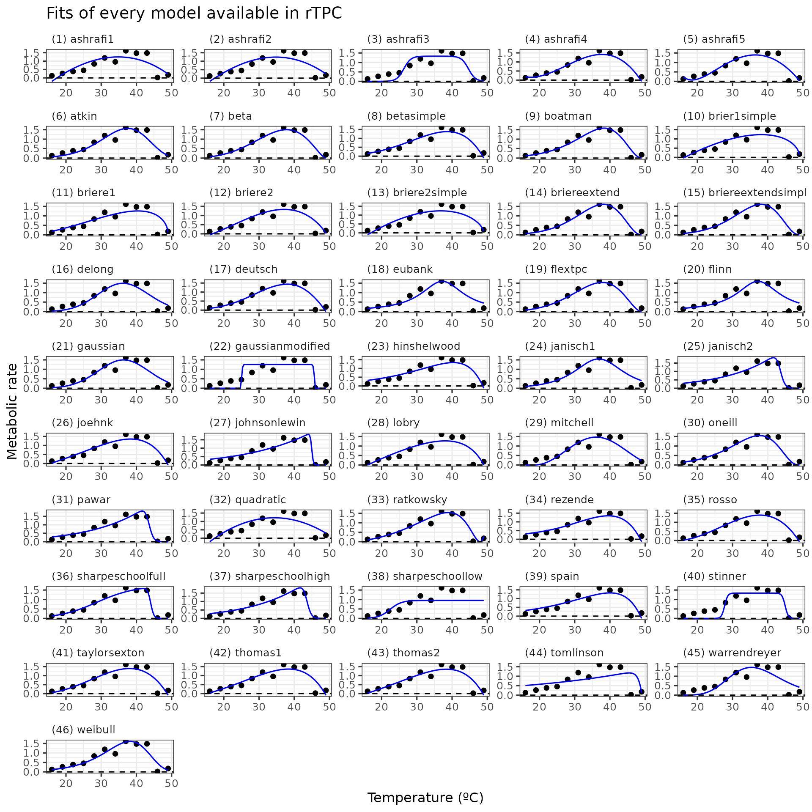

# Fitting many models with rTPC

#### A brief example of how multiple models can be fitted to a single TPC using rTPC, nls.multstart, and the tidyverse.

------------------------------------------------------------------------

## Things to consider

- How many data points do you have for each curve? To fit all of the 49
  models in **rTPC**, there needs to be a minimum of 7 points per curve.
- If there are multiple individual curves to be fit, it makes sense to
  have your data in long format, where grouping variables (e.g. unique
  curve identifier), temperature and rate have their own columns.
- Are there negative rate values? If a curve that crosses the x axis, it
  might be beneficial to only consider models that are capable of
  modelling negative values.
- Are there specific parameters you are interested in? If so, it may be
  beneficial to only consider models that explicitly include that
  parameter in their formulation.

------------------------------------------------------------------------

``` r
# load packages
library(rTPC)
library(nls.multstart)
library(broom)
library(tidyverse)

# write function to label ggplot2 panels
label_facets_num <- function(string) {
  len <- length(string)
  string = paste('(', 1:len, ') ', string, sep = '')
  return(string)
}
```

After searching the literature, **rTPC** contains 49 different model
formulations previously used. The [first
vignette](https://padpadpadpad.github.io/rTPC/articles/rTPC.md),
demonstrated how to easily fit a single model to a single curve, here we
will fit all 49 model formulations.

**DISCLAIMER Although we fit all 49 model formulations, this is to
demonstrate how they fit and their general shape, we do not recommend
doing model selection on 49 model formulations. SERIOUSLY, PLEASE DO NOT
DO THIS.**

We can demonstrate the fitting procedure of the 49 model formulations by
taking a single curve from the example dataset **rTPC** - a dataset of
60 TPCs of respiration and photosynthesis of the aquatic algae,
*Chlorella vulgaris*. We can plot the data using **ggplot2**

``` r
# load in data
data("chlorella_tpc")

# keep just a single curve
d <- filter(chlorella_tpc, curve_id == 1)

# show the data
ggplot(d, aes(temp, rate)) +
  geom_point() +
  theme_bw(base_size = 12) +
  labs(
    x = 'Temperature (ºC)',
    y = 'Metabolic rate',
    title = 'Respiration across temperatures'
  )
```


When fitting multiple models, we take advantage of list columns and
functionality provided by **purrr**. A great introduction to this is the
“[Many Models](https://r4ds.had.co.nz/many-models.html)” Chapter of R
for Data Science.

For a single curve, we nest the dataframe, creating a list column which
contains the temperature and rate values. We then write a function that
fits all models in a single curve and returns a **tibble** where each
column is a different model use **purrr::map()** to fit all the models
to the data that we will then pass to **purrr**. This is how we
*strongly* recommend fitting multiple models using **map()** as it
allows you to easily take advantage of the built-in progress bar
functionality, and makes it easier to parallelise model fitting.

We use a gridstart approach when fitting the models with
**nls_multstart()**. This method creates a combination of start
parameters, equally spaced across each of the starting parameter bounds.
This can be specified with a vector of the same length as the number of
parameters, c(5, 5, 5) for 3 estimated parameters will yield 125
iterations.

You can see how silly our approach of fitting every model is because of
how many lines of code it takes up!

``` r
# write a function to fit all models
fit_TPCs <- function(d, ...) {
  analytis <- nls_multstart(
    rate ~ analytiskontodimas_2004(temp = temp, a, tmin, tmax),
    data = d,
    iter = c(6, 6, 6),
    start_lower = get_start_vals(
      d$temp,
      d$rate,
      model_name = 'analytiskontodimas_2004'
    ) -
      10,
    start_upper = get_start_vals(
      d$temp,
      d$rate,
      model_name = 'analytiskontodimas_2004'
    ) +
      10,
    lower = get_lower_lims(
      d$temp,
      d$rate,
      model_name = 'analytiskontodimas_2004'
    ),
    upper = get_upper_lims(
      d$temp,
      d$rate,
      model_name = 'analytiskontodimas_2004'
    ),
    supp_errors = 'Y',
    convergence_count = FALSE
  )
  ashrafi1 <- nls_multstart(
    rate ~ ashrafi1_2018(temp = temp, a, b, c),
    data = d,
    iter = c(6, 6, 6),
    start_lower = get_start_vals(
      d$temp,
      d$rate,
      model_name = 'ashrafi1_2018'
    ) -
      10,
    start_upper = get_start_vals(
      d$temp,
      d$rate,
      model_name = 'ashrafi1_2018'
    ) +
      10,
    lower = get_lower_lims(
      d$temp,
      d$rate,
      model_name = 'ashrafi1_2018'
    ),
    upper = get_upper_lims(
      d$temp,
      d$rate,
      model_name = 'ashrafi1_2018'
    ),
    supp_errors = 'Y',
    convergence_count = FALSE
  )
  ashrafi2 <- nls_multstart(
    rate ~ ashrafi2_2018(temp = temp, a, b, c),
    data = d,
    iter = c(6, 6, 6),
    start_lower = get_start_vals(
      d$temp,
      d$rate,
      model_name = 'ashrafi2_2018'
    ) -
      10,
    start_upper = get_start_vals(
      d$temp,
      d$rate,
      model_name = 'ashrafi2_2018'
    ) +
      10,
    lower = get_lower_lims(
      d$temp,
      d$rate,
      model_name = 'ashrafi2_2018'
    ),
    upper = get_upper_lims(
      d$temp,
      d$rate,
      model_name = 'ashrafi2_2018'
    ),
    supp_errors = 'Y',
    convergence_count = FALSE
  )
  ashrafi3 <- nls_multstart(
    rate ~ ashrafi3_2018(temp = temp, a, b, c),
    data = d,
    iter = c(6, 6, 6),
    start_lower = get_start_vals(
      d$temp,
      d$rate,
      model_name = 'ashrafi3_2018'
    ) -
      10,
    start_upper = get_start_vals(
      d$temp,
      d$rate,
      model_name = 'ashrafi3_2018'
    ) +
      10,
    lower = get_lower_lims(
      d$temp,
      d$rate,
      model_name = 'ashrafi3_2018'
    ),
    upper = get_upper_lims(
      d$temp,
      d$rate,
      model_name = 'ashrafi3_2018'
    ),
    supp_errors = 'Y',
    convergence_count = FALSE
  )
  ashrafi4 <- nls_multstart(
    rate ~ ashrafi4_2018(temp = temp, a, b, c, d),
    data = d,
    iter = c(6, 6, 6, 6),
    start_lower = get_start_vals(
      d$temp,
      d$rate,
      model_name = 'ashrafi4_2018'
    ) -
      10,
    start_upper = get_start_vals(
      d$temp,
      d$rate,
      model_name = 'ashrafi4_2018'
    ) +
      10,
    lower = get_lower_lims(
      d$temp,
      d$rate,
      model_name = 'ashrafi4_2018'
    ),
    upper = get_upper_lims(
      d$temp,
      d$rate,
      model_name = 'ashrafi4_2018'
    ),
    supp_errors = 'Y',
    convergence_count = FALSE
  )
  ashrafi5 <- nls_multstart(
    rate ~ ashrafi5_2018(temp = temp, a, b, c, d),
    data = d,
    iter = c(6, 6, 6, 6),
    start_lower = get_start_vals(
      d$temp,
      d$rate,
      model_name = 'ashrafi5_2018'
    ) -
      10,
    start_upper = get_start_vals(
      d$temp,
      d$rate,
      model_name = 'ashrafi5_2018'
    ) +
      10,
    lower = get_lower_lims(
      d$temp,
      d$rate,
      model_name = 'ashrafi5_2018'
    ),
    upper = get_upper_lims(
      d$temp,
      d$rate,
      model_name = 'ashrafi5_2018'
    ),
    supp_errors = 'Y',
    convergence_count = FALSE
  )
  atkin <- nls_multstart(
    rate ~ atkin_2005(temp = temp, r0, a, b),
    data = d,
    iter = c(6, 6, 6),
    start_lower = get_start_vals(
      d$temp,
      d$rate,
      model_name = 'atkin_2005'
    ) -
      10,
    start_upper = get_start_vals(
      d$temp,
      d$rate,
      model_name = 'atkin_2005'
    ) +
      10,
    lower = get_lower_lims(d$temp, d$rate, model_name = 'atkin_2005'),
    upper = get_upper_lims(d$temp, d$rate, model_name = 'atkin_2005'),
    supp_errors = 'Y',
    convergence_count = FALSE
  )
  beta <- nls_multstart(
    rate ~ beta_2012(temp = temp, a, b, c, d, e),
    data = d,
    iter = c(6, 6, 6, 6, 6),
    start_lower = get_start_vals(
      d$temp,
      d$rate,
      model_name = 'beta_2012'
    ) -
      10,
    start_upper = get_start_vals(
      d$temp,
      d$rate,
      model_name = 'beta_2012'
    ) +
      10,
    lower = get_lower_lims(d$temp, d$rate, model_name = 'beta_2012'),
    upper = get_upper_lims(d$temp, d$rate, model_name = 'beta_2012'),
    supp_errors = 'Y',
    convergence_count = FALSE
  )
  betasimple <- nls_multstart(
    rate ~ betatypesimplified_2008(temp = temp, rho, alpha, beta),
    data = d,
    iter = c(6, 6, 6),
    start_lower = get_start_vals(
      d$temp,
      d$rate,
      model_name = 'betatypesimplified_2008'
    ) -
      10,
    start_upper = get_start_vals(
      d$temp,
      d$rate,
      model_name = 'betatypesimplified_2008'
    ) +
      10,
    lower = get_lower_lims(
      d$temp,
      d$rate,
      model_name = 'betatypesimplified_2008'
    ),
    upper = get_upper_lims(
      d$temp,
      d$rate,
      model_name = 'betatypesimplified_2008'
    ),
    supp_errors = 'Y',
    convergence_count = FALSE
  )
  boatman <- nls_multstart(
    rate ~ boatman_2017(temp = temp, rmax, tmin, tmax, a, b),
    data = d,
    iter = c(4, 4, 4, 4, 4),
    start_lower = get_start_vals(
      d$temp,
      d$rate,
      model_name = 'boatman_2017'
    ) -
      10,
    start_upper = get_start_vals(
      d$temp,
      d$rate,
      model_name = 'boatman_2017'
    ) +
      10,
    lower = get_lower_lims(d$temp, d$rate, model_name = 'boatman_2017'),
    upper = get_upper_lims(d$temp, d$rate, model_name = 'boatman_2017'),
    supp_errors = 'Y',
    convergence_count = FALSE
  )
  briere1 <- nls_multstart(
    rate ~ briere1_1999(temp = temp, tmin, tmax, a),
    data = d,
    iter = c(4, 4, 4),
    start_lower = get_start_vals(
      d$temp,
      d$rate,
      model_name = 'briere1_1999'
    ) -
      10,
    start_upper = get_start_vals(
      d$temp,
      d$rate,
      model_name = 'briere1_1999'
    ) +
      10,
    lower = get_lower_lims(d$temp, d$rate, model_name = 'briere1_1999'),
    upper = get_upper_lims(d$temp, d$rate, model_name = 'briere1_1999'),
    supp_errors = 'Y',
    convergence_count = FALSE
  )
  briere1simple <- nls_multstart(
    rate ~ briere1simplified_1999(temp = temp, tmin, tmax, a),
    data = d,
    iter = c(4, 4, 4),
    start_lower = get_start_vals(
      d$temp,
      d$rate,
      model_name = 'briere1simplified_1999'
    ) -
      10,
    start_upper = get_start_vals(
      d$temp,
      d$rate,
      model_name = 'briere1simplified_1999'
    ) +
      10,
    lower = get_lower_lims(
      d$temp,
      d$rate,
      model_name = 'briere1simplified_1999'
    ),
    upper = get_upper_lims(
      d$temp,
      d$rate,
      model_name = 'briere1simplified_1999'
    ),
    supp_errors = 'Y',
    convergence_count = FALSE
  )
  briere2 <- nls_multstart(
    rate ~ briere2_1999(temp = temp, tmin, tmax, a, b),
    data = d,
    iter = c(4, 4, 4, 4),
    start_lower = get_start_vals(
      d$temp,
      d$rate,
      model_name = 'briere2_1999'
    ) -
      10,
    start_upper = get_start_vals(
      d$temp,
      d$rate,
      model_name = 'briere2_1999'
    ) +
      10,
    lower = get_lower_lims(d$temp, d$rate, model_name = 'briere2_1999'),
    upper = get_upper_lims(d$temp, d$rate, model_name = 'briere2_1999'),
    supp_errors = 'Y',
    convergence_count = FALSE
  )
  briere2simple <- nls_multstart(
    rate ~ briere2simplified_1999(temp = temp, tmin, tmax, a, b),
    data = d,
    iter = c(4, 4, 4, 4),
    start_lower = get_start_vals(
      d$temp,
      d$rate,
      model_name = 'briere2simplified_1999'
    ) -
      10,
    start_upper = get_start_vals(
      d$temp,
      d$rate,
      model_name = 'briere2simplified_1999'
    ) +
      10,
    lower = get_lower_lims(
      d$temp,
      d$rate,
      model_name = 'briere2simplified_1999'
    ),
    upper = get_upper_lims(
      d$temp,
      d$rate,
      model_name = 'briere2simplified_1999'
    ),
    supp_errors = 'Y',
    convergence_count = FALSE
  )
  briereextend <- nls_multstart(
    rate ~ briereextended_2021(temp = temp, tmin, tmax, a, b, d),
    data = d,
    iter = c(4, 4, 4, 4, 4),
    start_lower = get_start_vals(
      d$temp,
      d$rate,
      model_name = 'briereextended_2021'
    ) -
      10,
    start_upper = get_start_vals(
      d$temp,
      d$rate,
      model_name = 'briereextended_2021'
    ) +
      10,
    lower = get_lower_lims(
      d$temp,
      d$rate,
      model_name = 'briereextended_2021'
    ),
    upper = get_upper_lims(
      d$temp,
      d$rate,
      model_name = 'briereextended_2021'
    ),
    supp_errors = 'Y',
    convergence_count = FALSE
  )
  briereextendsimple <- nls_multstart(
    rate ~ briereextendedsimplified_2021(temp = temp, tmin, tmax, a, b, d),
    data = d,
    iter = c(4, 4, 4, 4, 4),
    start_lower = get_start_vals(
      d$temp,
      d$rate,
      model_name = 'briereextendedsimplified_2021'
    ) -
      10,
    start_upper = get_start_vals(
      d$temp,
      d$rate,
      model_name = 'briereextendedsimplified_2021'
    ) +
      10,
    lower = get_lower_lims(
      d$temp,
      d$rate,
      model_name = 'briereextendedsimplified_2021'
    ),
    upper = get_upper_lims(
      d$temp,
      d$rate,
      model_name = 'briereextendedsimplified_2021'
    ),
    supp_errors = 'Y',
    convergence_count = FALSE
  )
  delong <- nls_multstart(
    rate ~ delong_2017(temp = temp, c, eb, ef, tm, ehc),
    data = d,
    iter = c(4, 4, 4, 4, 4),
    start_lower = get_start_vals(
      d$temp,
      d$rate,
      model_name = 'delong_2017'
    ) -
      10,
    start_upper = get_start_vals(
      d$temp,
      d$rate,
      model_name = 'delong_2017'
    ) +
      10,
    lower = get_lower_lims(d$temp, d$rate, model_name = 'delong_2017'),
    upper = get_upper_lims(d$temp, d$rate, model_name = 'delong_2017'),
    supp_errors = 'Y',
    convergence_count = FALSE
  )
  deutsch <- nls_multstart(
    rate ~ deutsch_2008(temp = temp, rmax, topt, ctmax, a),
    data = d,
    iter = c(4, 4, 4, 4),
    start_lower = get_start_vals(
      d$temp,
      d$rate,
      model_name = 'deutsch_2008'
    ) -
      10,
    start_upper = get_start_vals(
      d$temp,
      d$rate,
      model_name = 'deutsch_2008'
    ) +
      10,
    lower = get_lower_lims(d$temp, d$rate, model_name = 'deutsch_2008'),
    upper = get_upper_lims(d$temp, d$rate, model_name = 'deutsch_2008'),
    supp_errors = 'Y',
    convergence_count = FALSE
  )
  eubank <- nls_multstart(
    rate ~ eubank_1973(temp = temp, topt, a, b),
    data = d,
    iter = c(4, 4, 4),
    start_lower = get_start_vals(
      d$temp,
      d$rate,
      model_name = 'eubank_1973'
    ) -
      10,
    start_upper = get_start_vals(
      d$temp,
      d$rate,
      model_name = 'eubank_1973'
    ) +
      10,
    lower = get_lower_lims(d$temp, d$rate, model_name = 'eubank_1973'),
    upper = get_upper_lims(d$temp, d$rate, model_name = 'eubank_1973'),
    supp_errors = 'Y',
    convergence_count = FALSE
  )
  flextpc <- nls_multstart(
    rate ~ flextpc_2024(temp = temp, tmin, tmax, rmax, alpha, beta),
    data = d,
    iter = c(5, 5, 5, 5, 5),
    start_lower = get_start_vals(
      d$temp,
      d$rate,
      model_name = 'flextpc_2024'
    ) -
      10,
    start_upper = get_start_vals(
      d$temp,
      d$rate,
      model_name = 'flextpc_2024'
    ) +
      10,
    lower = get_lower_lims(d$temp, d$rate, model_name = 'flextpc_2024'),
    upper = get_upper_lims(d$temp, d$rate, model_name = 'flextpc_2024'),
    supp_errors = 'Y',
    convergence_count = FALSE
  )
  flinn <- nls_multstart(
    rate ~ flinn_1991(temp = temp, a, b, c),
    data = d,
    iter = c(5, 5, 5),
    start_lower = get_start_vals(
      d$temp,
      d$rate,
      model_name = 'flinn_1991'
    ) -
      10,
    start_upper = get_start_vals(
      d$temp,
      d$rate,
      model_name = 'flinn_1991'
    ) +
      10,
    lower = get_lower_lims(d$temp, d$rate, model_name = 'flinn_1991'),
    upper = get_upper_lims(d$temp, d$rate, model_name = 'flinn_1991'),
    supp_errors = 'Y',
    convergence_count = FALSE
  )
  gaussian <- nls_multstart(
    rate ~ gaussian_1987(temp = temp, rmax, topt, a),
    data = d,
    iter = c(4, 4, 4),
    start_lower = get_start_vals(
      d$temp,
      d$rate,
      model_name = 'gaussian_1987'
    ) -
      10,
    start_upper = get_start_vals(
      d$temp,
      d$rate,
      model_name = 'gaussian_1987'
    ) +
      10,
    lower = get_lower_lims(
      d$temp,
      d$rate,
      model_name = 'gaussian_1987'
    ),
    upper = get_upper_lims(
      d$temp,
      d$rate,
      model_name = 'gaussian_1987'
    ),
    supp_errors = 'Y',
    convergence_count = FALSE
  )
  gaussianmodified <- nls_multstart(
    rate ~ gaussianmodified_2006(temp = temp, rmax, topt, a, b),
    data = d,
    iter = c(4, 4, 4, 4),
    start_lower = get_start_vals(
      d$temp,
      d$rate,
      model_name = 'gaussianmodified_2006'
    ) -
      10,
    start_upper = get_start_vals(
      d$temp,
      d$rate,
      model_name = 'gaussianmodified_2006'
    ) +
      10,
    lower = get_lower_lims(
      d$temp,
      d$rate,
      model_name = 'gaussianmodified_2006'
    ),
    upper = get_upper_lims(
      d$temp,
      d$rate,
      model_name = 'gaussianmodified_2006'
    ),
    supp_errors = 'Y',
    convergence_count = FALSE
  )
  hinshelwood <- nls_multstart(
    rate ~ hinshelwood_1947(temp = temp, a, e, b, eh),
    data = d,
    iter = c(5, 5, 5, 5),
    start_lower = get_start_vals(
      d$temp,
      d$rate,
      model_name = 'hinshelwood_1947'
    ) -
      1,
    start_upper = get_start_vals(
      d$temp,
      d$rate,
      model_name = 'hinshelwood_1947'
    ) +
      1,
    lower = get_lower_lims(
      d$temp,
      d$rate,
      model_name = 'hinshelwood_1947'
    ),
    upper = get_upper_lims(
      d$temp,
      d$rate,
      model_name = 'hinshelwood_1947'
    ),
    supp_errors = 'Y',
    convergence_count = FALSE
  )
  janisch1 <- nls_multstart(
    rate ~ janisch1_1925(temp = temp, m, a, topt),
    data = d,
    iter = c(5, 5, 5),
    start_lower = get_start_vals(
      d$temp,
      d$rate,
      model_name = 'janisch1_1925'
    ) -
      1,
    start_upper = get_start_vals(
      d$temp,
      d$rate,
      model_name = 'janisch1_1925'
    ) +
      1,
    lower = get_lower_lims(
      d$temp,
      d$rate,
      model_name = 'janisch1_1925'
    ),
    upper = get_upper_lims(
      d$temp,
      d$rate,
      model_name = 'janisch1_1925'
    ),
    supp_errors = 'Y',
    convergence_count = FALSE
  )
  janisch2 <- nls_multstart(
    rate ~ janisch2_1925(temp = temp, m, a, b, topt),
    data = d,
    iter = c(5, 5, 5, 5),
    start_lower = get_start_vals(
      d$temp,
      d$rate,
      model_name = 'janisch2_1925'
    ) -
      1,
    start_upper = get_start_vals(
      d$temp,
      d$rate,
      model_name = 'janisch2_1925'
    ) +
      1,
    lower = get_lower_lims(
      d$temp,
      d$rate,
      model_name = 'janisch2_1925'
    ),
    upper = get_upper_lims(
      d$temp,
      d$rate,
      model_name = 'janisch2_1925'
    ),
    supp_errors = 'Y',
    convergence_count = FALSE
  )
  joehnk <- nls_multstart(
    rate ~ joehnk_2008(temp = temp, rmax, topt, a, b, c),
    data = d,
    iter = c(4, 4, 4, 4, 4),
    start_lower = get_start_vals(
      d$temp,
      d$rate,
      model_name = 'joehnk_2008'
    ) -
      10,
    start_upper = get_start_vals(
      d$temp,
      d$rate,
      model_name = 'joehnk_2008'
    ) +
      10,
    lower = get_lower_lims(d$temp, d$rate, model_name = 'joehnk_2008'),
    upper = get_upper_lims(d$temp, d$rate, model_name = 'joehnk_2008'),
    supp_errors = 'Y',
    convergence_count = FALSE
  )
  johnson_lewin <- suppressWarnings(nls_multstart(
    rate ~ johnsonlewin_1946(temp = temp, r0, e, eh, topt),
    data = d,
    iter = c(4, 4, 4, 4),
    start_lower = get_start_vals(
      d$temp,
      d$rate,
      model_name = 'johnsonlewin_1946'
    ) -
      1,
    start_upper = get_start_vals(
      d$temp,
      d$rate,
      model_name = 'johnsonlewin_1946'
    ) +
      1,
    lower = get_lower_lims(
      d$temp,
      d$rate,
      model_name = 'johnsonlewin_1946'
    ),
    upper = get_upper_lims(
      d$temp,
      d$rate,
      model_name = 'johnsonlewin_1946'
    ),
    supp_errors = 'Y',
    convergence_count = FALSE
  ))
  kamykowski <- nls_multstart(
    rate ~ kamykowski_1985(temp = temp, tmin, tmax, a, b, c),
    data = d,
    iter = c(4, 4, 4, 4, 4),
    start_lower = get_start_vals(
      d$temp,
      d$rate,
      model_name = 'kamykowski_1985'
    ) -
      10,
    start_upper = get_start_vals(
      d$temp,
      d$rate,
      model_name = 'kamykowski_1985'
    ) +
      10,
    lower = get_lower_lims(
      d$temp,
      d$rate,
      model_name = 'kamykowski_1985'
    ),
    upper = get_upper_lims(
      d$temp,
      d$rate,
      model_name = 'kamykowski_1985'
    ),
    supp_errors = 'Y',
    convergence_count = FALSE
  )
  lactin2 <- nls_multstart(
    rate ~ lactin2_1995(temp = temp, a, b, tmax, delta_t),
    data = d,
    iter = c(4, 4, 4, 4),
    start_lower = get_start_vals(
      d$temp,
      d$rate,
      model_name = 'lactin2_1995'
    ) -
      10,
    start_upper = get_start_vals(
      d$temp,
      d$rate,
      model_name = 'lactin2_1995'
    ) +
      10,
    lower = get_lower_lims(d$temp, d$rate, model_name = 'lactin2_1995'),
    upper = get_upper_lims(d$temp, d$rate, model_name = 'lactin2_1995'),
    supp_errors = 'Y',
    convergence_count = FALSE
  )
  lobry <- nls_multstart(
    rate ~ lobry_1991(temp = temp, rmax, topt, tmin, tmax),
    data = d,
    iter = c(4, 4, 4, 4),
    start_lower = get_start_vals(
      d$temp,
      d$rate,
      model_name = 'lobry_1991'
    ) -
      10,
    start_upper = get_start_vals(
      d$temp,
      d$rate,
      model_name = 'lobry_1991'
    ) +
      10,
    lower = get_lower_lims(d$temp, d$rate, model_name = 'lobry_1991'),
    upper = get_upper_lims(d$temp, d$rate, model_name = 'lobry_1991'),
    supp_errors = 'Y',
    convergence_count = FALSE
  )
  mitchell <- nls_multstart(
    rate ~ mitchell_2009(temp = temp, topt, a, b),
    data = d,
    iter = c(4, 4, 4),
    start_lower = get_start_vals(
      d$temp,
      d$rate,
      model_name = 'mitchell_2009'
    ) -
      10,
    start_upper = get_start_vals(
      d$temp,
      d$rate,
      model_name = 'mitchell_2009'
    ) +
      10,
    lower = get_lower_lims(
      d$temp,
      d$rate,
      model_name = 'mitchell_2009'
    ),
    upper = get_upper_lims(
      d$temp,
      d$rate,
      model_name = 'mitchell_2009'
    ),
    supp_errors = 'Y',
    convergence_count = FALSE
  )
  oneill <- nls_multstart(
    rate ~ oneill_1972(temp = temp, rmax, ctmax, topt, q10),
    data = d,
    iter = c(4, 4, 4, 4),
    start_lower = get_start_vals(
      d$temp,
      d$rate,
      model_name = 'oneill_1972'
    ) -
      10,
    start_upper = get_start_vals(
      d$temp,
      d$rate,
      model_name = 'oneill_1972'
    ) +
      10,
    lower = get_lower_lims(d$temp, d$rate, model_name = 'oneill_1972'),
    upper = get_upper_lims(d$temp, d$rate, model_name = 'oneill_1972'),
    supp_errors = 'Y',
    convergence_count = FALSE
  )
  pawar <- nls_multstart(
    rate ~ pawar_2018(temp = temp, r_tref, e, eh, topt, tref = 15),
    data = d,
    iter = c(4, 4, 4, 4),
    start_lower = get_start_vals(
      d$temp,
      d$rate,
      model_name = 'pawar_2018'
    ) -
      10,
    start_upper = get_start_vals(
      d$temp,
      d$rate,
      model_name = 'pawar_2018'
    ) +
      10,
    lower = get_lower_lims(d$temp, d$rate, model_name = 'pawar_2018'),
    upper = get_upper_lims(d$temp, d$rate, model_name = 'pawar_2018'),
    supp_errors = 'Y',
    convergence_count = FALSE
  )
  quadratic <- nls_multstart(
    rate ~ quadratic_2008(temp = temp, a, b, c),
    data = d,
    iter = c(4, 4, 4),
    start_lower = get_start_vals(
      d$temp,
      d$rate,
      model_name = 'quadratic_2008'
    ) -
      0.5,
    start_upper = get_start_vals(
      d$temp,
      d$rate,
      model_name = 'quadratic_2008'
    ) +
      0.5,
    lower = get_lower_lims(
      d$temp,
      d$rate,
      model_name = 'quadratic_2008'
    ),
    upper = get_upper_lims(
      d$temp,
      d$rate,
      model_name = 'quadratic_2008'
    ),
    supp_errors = 'Y',
    convergence_count = FALSE
  )
  ratkowsky <- nls_multstart(
    rate ~ ratkowsky_1983(temp = temp, tmin, tmax, a, b),
    data = d,
    iter = c(4, 4, 4, 4),
    start_lower = get_start_vals(
      d$temp,
      d$rate,
      model_name = 'ratkowsky_1983'
    ) -
      10,
    start_upper = get_start_vals(
      d$temp,
      d$rate,
      model_name = 'ratkowsky_1983'
    ) +
      10,
    lower = get_lower_lims(
      d$temp,
      d$rate,
      model_name = 'ratkowsky_1983'
    ),
    upper = get_upper_lims(
      d$temp,
      d$rate,
      model_name = 'ratkowsky_1983'
    ),
    supp_errors = 'Y',
    convergence_count = FALSE
  )
  rezende <- nls_multstart(
    rate ~ rezende_2019(temp = temp, q10, a, b, c),
    data = d,
    iter = c(4, 4, 4, 4),
    start_lower = get_start_vals(
      d$temp,
      d$rate,
      model_name = 'rezende_2019'
    ) -
      10,
    start_upper = get_start_vals(
      d$temp,
      d$rate,
      model_name = 'rezende_2019'
    ) +
      10,
    lower = get_lower_lims(d$temp, d$rate, model_name = 'rezende_2019'),
    upper = get_upper_lims(d$temp, d$rate, model_name = 'rezende_2019'),
    supp_errors = 'Y',
    convergence_count = FALSE
  )
  rosso <- nls_multstart(
    rate ~ rosso_1993(temp = temp, rmax, topt, tmin, tmax),
    data = d,
    iter = c(3, 3, 3, 3),
    start_lower = get_start_vals(
      d$temp,
      d$rate,
      model_name = 'rosso_1993'
    ) -
      10,
    start_upper = get_start_vals(
      d$temp,
      d$rate,
      model_name = 'rosso_1993'
    ) +
      10,
    lower = get_lower_lims(d$temp, d$rate, model_name = 'rosso_1993'),
    upper = get_upper_lims(d$temp, d$rate, model_name = 'rosso_1993'),
    supp_errors = 'Y',
    convergence_count = FALSE
  )
  sharpeschoolfull <- nls_multstart(
    rate ~
      sharpeschoolfull_1981(
        temp = temp,
        r_tref,
        e,
        el,
        tl,
        eh,
        th,
        tref = 15
      ),
    data = d,
    iter = c(4, 4, 4, 4, 4, 4),
    start_lower = get_start_vals(
      d$temp,
      d$rate,
      model_name = 'sharpeschoolfull_1981'
    ) -
      10,
    start_upper = get_start_vals(
      d$temp,
      d$rate,
      model_name = 'sharpeschoolfull_1981'
    ) +
      10,
    lower = get_lower_lims(
      d$temp,
      d$rate,
      model_name = 'sharpeschoolfull_1981'
    ),
    upper = get_upper_lims(
      d$temp,
      d$rate,
      model_name = 'sharpeschoolfull_1981'
    ),
    supp_errors = 'Y',
    convergence_count = FALSE
  )
  sharpeschoolhigh <- nls_multstart(
    rate ~ sharpeschoolhigh_1981(temp = temp, r_tref, e, eh, th, tref = 15),
    data = d,
    iter = c(4, 4, 4, 4),
    start_lower = get_start_vals(
      d$temp,
      d$rate,
      model_name = 'sharpeschoolhigh_1981'
    ) -
      10,
    start_upper = get_start_vals(
      d$temp,
      d$rate,
      model_name = 'sharpeschoolhigh_1981'
    ) +
      10,
    lower = get_lower_lims(
      d$temp,
      d$rate,
      model_name = 'sharpeschoolhigh_1981'
    ),
    upper = get_upper_lims(
      d$temp,
      d$rate,
      model_name = 'sharpeschoolhigh_1981'
    ),
    supp_errors = 'Y',
    convergence_count = FALSE
  )
  sharpeschoollow <- nls_multstart(
    rate ~ sharpeschoollow_1981(temp = temp, r_tref, e, el, tl, tref = 15),
    data = d,
    iter = c(4, 4, 4, 4),
    start_lower = get_start_vals(
      d$temp,
      d$rate,
      model_name = 'sharpeschoollow_1981'
    ) -
      10,
    start_upper = get_start_vals(
      d$temp,
      d$rate,
      model_name = 'sharpeschoollow_1981'
    ) +
      10,
    lower = get_lower_lims(
      d$temp,
      d$rate,
      model_name = 'sharpeschoollow_1981'
    ),
    upper = get_upper_lims(
      d$temp,
      d$rate,
      model_name = 'sharpeschoollow_1981'
    ),
    supp_errors = 'Y',
    convergence_count = FALSE
  )
  spain <- nls_multstart(
    rate ~ spain_1982(temp = temp, a, b, c, r0),
    data = d,
    iter = c(4, 4, 4, 4),
    start_lower = get_start_vals(
      d$temp,
      d$rate,
      model_name = 'spain_1982'
    ) -
      1,
    start_upper = get_start_vals(
      d$temp,
      d$rate,
      model_name = 'spain_1982'
    ) +
      1,
    lower = get_lower_lims(d$temp, d$rate, model_name = 'spain_1982'),
    upper = get_upper_lims(d$temp, d$rate, model_name = 'spain_1982'),
    supp_errors = 'Y',
    convergence_count = FALSE
  )
  stinner <- nls_multstart(
    rate ~ stinner_1974(temp = temp, rmax, topt, a, b),
    data = d,
    iter = c(6, 6, 6, 6),
    start_lower = get_start_vals(
      d$temp,
      d$rate,
      model_name = 'stinner_1974'
    ) -
      10,
    start_upper = get_start_vals(
      d$temp,
      d$rate,
      model_name = 'stinner_1974'
    ) +
      10,
    lower = get_lower_lims(d$temp, d$rate, model_name = 'stinner_1974'),
    upper = get_upper_lims(d$temp, d$rate, model_name = 'stinner_1974'),
    supp_errors = 'Y',
    convergence_count = FALSE
  )
  taylorsexton <- nls_multstart(
    rate ~ taylorsexton_1972(temp = temp, rmax, tmin, topt),
    data = d,
    iter = c(4, 4, 4),
    start_lower = get_start_vals(
      d$temp,
      d$rate,
      model_name = 'taylorsexton_1972'
    ) -
      10,
    start_upper = get_start_vals(
      d$temp,
      d$rate,
      model_name = 'taylorsexton_1972'
    ) +
      10,
    lower = get_lower_lims(
      d$temp,
      d$rate,
      model_name = 'taylorsexton_1972'
    ),
    upper = get_upper_lims(
      d$temp,
      d$rate,
      model_name = 'taylorsexton_1972'
    ),
    supp_errors = 'Y',
    convergence_count = FALSE
  )
  thomas1 <- nls_multstart(
    rate ~ thomas_2012(temp = temp, a, b, c, tref),
    data = d,
    iter = c(4, 4, 4, 4),
    start_lower = get_start_vals(
      d$temp,
      d$rate,
      model_name = 'thomas_2012'
    ) -
      1,
    start_upper = get_start_vals(
      d$temp,
      d$rate,
      model_name = 'thomas_2012'
    ) +
      2,
    lower = get_lower_lims(d$temp, d$rate, model_name = 'thomas_2012'),
    upper = get_upper_lims(d$temp, d$rate, model_name = 'thomas_2012'),
    supp_errors = 'Y',
    convergence_count = FALSE
  )
  thomas2 <- nls_multstart(
    rate ~ thomas_2017(temp = temp, a, b, c, d, e),
    data = d,
    iter = c(3, 3, 3, 3, 3),
    start_lower = get_start_vals(
      d$temp,
      d$rate,
      model_name = 'thomas_2017'
    ) -
      10,
    start_upper = get_start_vals(
      d$temp,
      d$rate,
      model_name = 'thomas_2017'
    ) +
      10,
    lower = get_lower_lims(d$temp, d$rate, model_name = 'thomas_2017'),
    upper = get_upper_lims(d$temp, d$rate, model_name = 'thomas_2017'),
    supp_errors = 'Y',
    convergence_count = FALSE
  )
  tomlinson <- nls_multstart(
    rate ~ tomlinsonphillips_2015(temp = temp, a, b, c),
    data = d,
    iter = c(4, 4, 4),
    start_lower = get_start_vals(
      d$temp,
      d$rate,
      model_name = 'tomlinsonphillips_2015'
    ) -
      10,
    start_upper = get_start_vals(
      d$temp,
      d$rate,
      model_name = 'tomlinsonphillips_2015'
    ) +
      10,
    lower = get_lower_lims(
      d$temp,
      d$rate,
      model_name = 'tomlinsonphillips_2015'
    ),
    upper = get_upper_lims(
      d$temp,
      d$rate,
      model_name = 'tomlinsonphillips_2015'
    ),
    supp_errors = 'Y',
    convergence_count = FALSE
  )
  warrendreyer <- nls_multstart(
    rate ~ warrendreyer_2006(temp = temp, rmax, topt, a),
    data = d,
    iter = c(4, 4, 4),
    start_lower = get_start_vals(
      d$temp,
      d$rate,
      model_name = 'warrendreyer_2006'
    ) -
      10,
    start_upper = get_start_vals(
      d$temp,
      d$rate,
      model_name = 'warrendreyer_2006'
    ) +
      10,
    lower = get_lower_lims(
      d$temp,
      d$rate,
      model_name = 'warrendreyer_2006'
    ),
    upper = get_upper_lims(
      d$temp,
      d$rate,
      model_name = 'warrendreyer_2006'
    ),
    supp_errors = 'Y',
    convergence_count = FALSE
  )
  weibull <- nls_multstart(
    rate ~ weibull_1995(temp = temp, a, topt, b, c),
    data = d,
    iter = c(4, 4, 4, 4),
    start_lower = get_start_vals(
      d$temp,
      d$rate,
      model_name = 'weibull_1995'
    ) -
      10,
    start_upper = get_start_vals(
      d$temp,
      d$rate,
      model_name = 'weibull_1995'
    ) +
      10,
    lower = get_lower_lims(d$temp, d$rate, model_name = 'weibull_1995'),
    upper = get_upper_lims(d$temp, d$rate, model_name = 'weibull_1995'),
    supp_errors = 'Y',
    convergence_count = FALSE
  )

  return(tibble(
    analytis = list(analytis),
    ashrafi1 = list(ashrafi1),
    ashrafi2 = list(ashrafi2),
    ashrafi3 = list(ashrafi3),
    ashrafi4 = list(ashrafi4),
    ashrafi5 = list(ashrafi5),
    atkin = list(atkin),
    beta = list(beta),
    betasimple = list(betasimple),
    boatman = list(boatman),
    briere1 = list(briere1),
    brier1simple = list(briere1simple),
    briere2 = list(briere2),
    briere2simple = list(briere2simple),
    briereextend = list(briereextend),
    briereextendsimple = list(briereextendsimple),
    delong = list(delong),
    deutsch = list(deutsch),
    eubank = list(eubank),
    flextpc = list(flextpc),
    flinn = list(flinn),
    gaussian = list(gaussian),
    gaussianmodified = list(gaussianmodified),
    hinshelwood = list(hinshelwood),
    janisch1 = list(janisch1),
    janisch2 = list(janisch2),
    joehnk = list(joehnk),
    johnsonlewin = list(johnson_lewin),
    lobry = list(lobry),
    mitchell = list(mitchell),
    oneill = list(oneill),
    pawar = list(pawar),
    quadratic = list(quadratic),
    ratkowsky = list(ratkowsky),
    rezende = list(rezende),
    rosso = list(rosso),
    sharpeschoolfull = list(sharpeschoolfull),
    sharpeschoolhigh = list(sharpeschoolhigh),
    sharpeschoollow = list(sharpeschoollow),
    spain = list(spain),
    stinner = list(stinner),
    taylorsexton = list(taylorsexton),
    thomas1 = list(thomas1),
    thomas2 = list(thomas2),
    tomlinson = list(tomlinson),
    warrendreyer = list(warrendreyer),
    weibull = list(weibull)
  ))
}

# fit every model formulation in rTPC
d_fits <- nest(d, data = c(temp, rate)) %>%
  mutate(
    mods = map(
      data,
      ~ fit_TPCs(d = .x),
      .progress = TRUE
    )
  ) %>%
  unnest(mods)
```

This gives us a dataframe with our grouping variables `curve_id`,
`growth_temp`, `process`, and `flux` first (not used here, but
demonstrate how this can be scaled to multiple curves). Next is our
`data` column which contains our temperature and rate data. Then is a
column for each of our models.

``` r
glimpse(select(d_fits, 1:7))
#> Rows: 1
#> Columns: 7
#> $ curve_id    <dbl> 1
#> $ growth_temp <dbl> 20
#> $ process     <chr> "acclimation"
#> $ flux        <chr> "respiration"
#> $ data        <list> [<tbl_df[12 x 2]>]
#> $ analytis    <list> [function () , resid, function () , rhs, function () , for…
#> $ ashrafi1    <list> [function () , resid, function () , rhs, function () , for…
```

Each column containing the model stores the actual model fit.

``` r
d_fits$beta[[1]]
#> Nonlinear regression model
#>   model: rate ~ beta_2012(temp = temp, a, b, c, d, e)
#>    data: data
#>      a      b      c      d      e 
#>  1.501 37.829 46.451  6.001  2.584 
#>  residual sum-of-squares: 0.6367
#> 
#> Number of iterations till stop: 95 
#> Achieved convergence tolerance: 1.49e-08
#> Reason stopped: Number of calls to `fcn' has reached or exceeded `maxfev' == 600.
```

The parameters from each model fit can be extracted using
**broom::tidy()**. However, as each model has parameters with different
meanings, this may not be very useful in this instance.

The predictions of each model can be estimated using
**broom::augment()**. This can be done on all models at once after the
models are stacked into long format. To create a smooth curve fit, the
predictions are done on a new temperature vector that has 100 points
over the temperature range. The predictions for each model formulation
are then visualised in **ggplot2**.

``` r
# stack models
d_stack <- select(d_fits, -data) %>%
  pivot_longer(., names_to = 'model_name', values_to = 'fit', ashrafi1:weibull)

# get parameters using tidy
params <- d_stack %>%
  mutate(., est = map(fit, tidy)) %>%
  select(-fit) %>%
  unnest(est)

# get predictions using augment
newdata <- tibble(temp = seq(min(d$temp), max(d$temp), length.out = 100))
d_preds <- d_stack %>%
  mutate(., preds = map(fit, augment, newdata = newdata)) %>%
  select(-fit) %>%
  unnest(preds)

# plot
ggplot(d_preds, aes(temp, rate)) +
  geom_point(aes(temp, rate), d) +
  geom_line(aes(temp, .fitted), col = 'blue') +
  facet_wrap(
    ~model_name,
    labeller = labeller(model_name = label_facets_num),
    scales = 'free',
    ncol = 5
  ) +
  theme_bw(base_size = 12) +
  theme(
    legend.position = 'none',
    strip.text = element_text(hjust = 0),
    strip.background = element_blank()
  ) +
  labs(
    x = 'Temperature (ºC)',
    y = 'Metabolic rate',
    title = 'Fits of every model available in rTPC'
  ) +
  geom_hline(aes(yintercept = 0), linetype = 2)
```



------------------------------------------------------------------------

## Troubleshooting curve fits

If any of the fits do not converge properly, there are things you can
try:

- Turning errors and warnings on using `supp_errors = 'N'` inside
  **nls_multstart()** should help identify potential problems.
- Change from the gridstart approach to the shotgun or latin hypercube
  approach of fitting models with **nls_multstart()**
- Change the boundaries of `start_lower` and `start_upper`. In most of
  these fits, we just +/- 10 from the output of **get_start_vals()**.
  Sometimes we had to change this value to +/- 1 to get reproducible
  fits. Or scaling the to be 0.5 times or 1.5 times the start values
  might help.
- Remove `lower` and `upper` arguments from the fitting process.

Built in 142.6433024s
