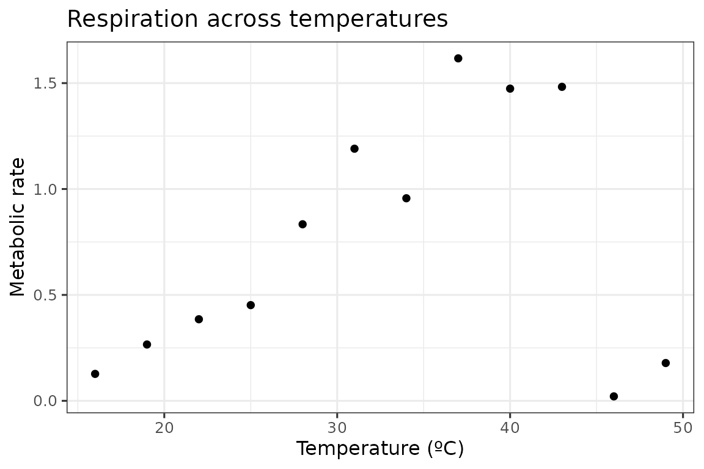
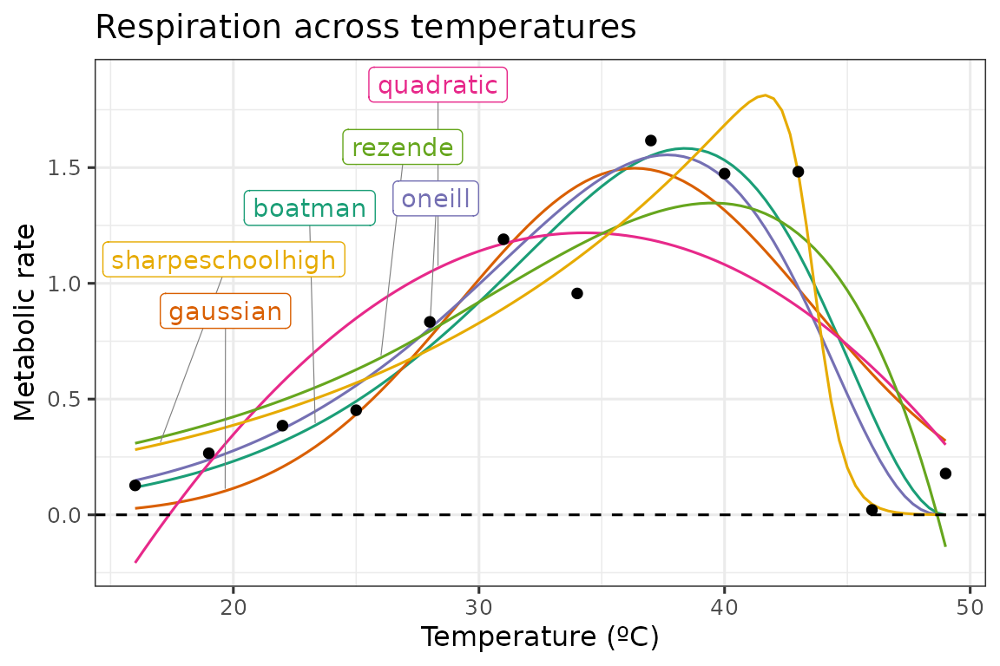
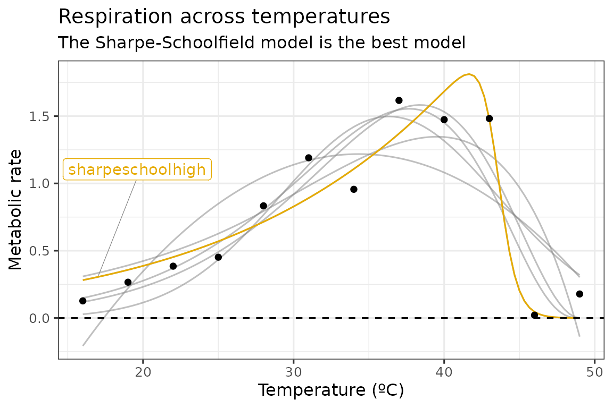
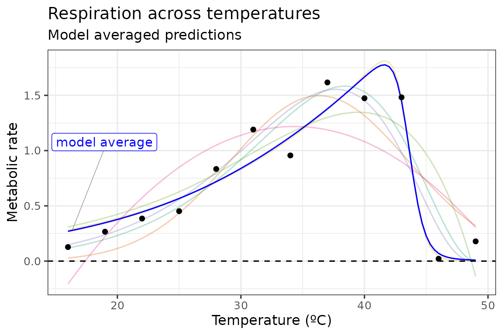

# Model selection and model averaging with rTPC

#### A brief example using model selection or model averaging when fitting multiple models to a single TPC using rTPC, nls.multstart, and the tidyverse.

------------------------------------------------------------------------

## Things to consider

- There is no magic bullet with model selection and model averaging.
- Think carefully about which models to fit **before** any fitting takes
  place.
- Should models be weighted when doing model averaging?
  - It seems illogical to allow a poor model to ruin the prediction, so
    it makes sense to down-weight it. This is the advice much of ecology
    takes: only average models within \\\Delta 2 AIC\\ of the best
    model.
  - If we have already pre-selected sensible models from the 49, it may
    often be wiser not to compute model weights. This is the common
    procedure in economics and with the IPCC earth-system-models.

------------------------------------------------------------------------

``` r
# load packages
library(rTPC)
library(nls.multstart)
library(broom)
library(tidyverse)
library(ggrepel)
```

The general pipeline demonstrates how models can be fitted, parameters
extracted, and predictions plotted to single or multiple curves using
functions in **rTPC**, **nls_multstart()**, and the **tidyverse**.

Here, we demonstrate how this pipeline can easily be extended to do (1)
model selection where the model that best supports the data is chosen or
(2) model averaging where multiple models are used to make predictions
or estimating extra parameters, usually by weighting each model by how
well they fit to the data.

Instead of picking all 49 model formulations to demonstrate these
approaches, we picked 5 models with different shaped curves (see
[`vignette('fit_many_models')`](https://padpadpadpad.github.io/rTPC/articles/fit_many_models.md)):
**boatman_2017()**, **gaussian_1987()**, **oneill_1972()**,
**quadratic_2008()**, **rezende_2019()**, and
**sharpeschoolhigh_1981()**

First, we fit each of these model formulations to a single curve from
the example dataset **rTPC** - a dataset of 60 TPCs of respiration and
photosynthesis of the aquatic algae, *Chlorella vulgaris*. We can plot
the data using **ggplot2**.

``` r
# load in data
data("chlorella_tpc")

# keep just a single curve
d <- filter(chlorella_tpc, curve_id == 1)

# show the data
ggplot(d, aes(temp, rate)) +
  geom_point() +
  theme_bw(base_size = 12) +
  labs(
    x = 'Temperature (ºC)',
    y = 'Metabolic rate',
    title = 'Respiration across temperatures'
  )
```



The 5 models are then be fitted using the same approach as in the
[`vignette('fit_many_models')`](https://padpadpadpad.github.io/rTPC/articles/fit_many_models.md),
using list columns and **purrr::map()** to fit and store multiple models
in a data frame. Again, we will write a function that fits all models
that we then pass to **purrr::map()**.

``` r
# write a function to fit the five models and output a tibble
fit_TPCs <- function(d, ...) {
  boatman <- nls_multstart(
    rate ~ boatman_2017(temp = temp, rmax, tmin, tmax, a, b),
    data = d,
    iter = c(4, 4, 4, 4, 4),
    start_lower = get_start_vals(
      d$temp,
      d$rate,
      model_name = 'boatman_2017'
    ) -
      10,
    start_upper = get_start_vals(
      d$temp,
      d$rate,
      model_name = 'boatman_2017'
    ) +
      10,
    lower = get_lower_lims(d$temp, d$rate, model_name = 'boatman_2017'),
    upper = get_upper_lims(d$temp, d$rate, model_name = 'boatman_2017'),
    supp_errors = 'Y',
    convergence_count = FALSE
  )
  gaussian <- nls_multstart(
    rate ~ gaussian_1987(temp = temp, rmax, topt, a),
    data = d,
    iter = c(4, 4, 4),
    start_lower = get_start_vals(
      d$temp,
      d$rate,
      model_name = 'gaussian_1987'
    ) -
      10,
    start_upper = get_start_vals(
      d$temp,
      d$rate,
      model_name = 'gaussian_1987'
    ) +
      10,
    lower = get_lower_lims(
      d$temp,
      d$rate,
      model_name = 'gaussian_1987'
    ),
    upper = get_upper_lims(
      d$temp,
      d$rate,
      model_name = 'gaussian_1987'
    ),
    supp_errors = 'Y',
    convergence_count = FALSE
  )
  oneill <- nls_multstart(
    rate ~ oneill_1972(temp = temp, rmax, ctmax, topt, q10),
    data = d,
    iter = c(4, 4, 4, 4),
    start_lower = get_start_vals(
      d$temp,
      d$rate,
      model_name = 'oneill_1972'
    ) -
      10,
    start_upper = get_start_vals(
      d$temp,
      d$rate,
      model_name = 'oneill_1972'
    ) +
      10,
    lower = get_lower_lims(d$temp, d$rate, model_name = 'oneill_1972'),
    upper = get_upper_lims(d$temp, d$rate, model_name = 'oneill_1972'),
    supp_errors = 'Y',
    convergence_count = FALSE
  )
  quadratic <- nls_multstart(
    rate ~ quadratic_2008(temp = temp, a, b, c),
    data = d,
    iter = c(4, 4, 4),
    start_lower = get_start_vals(
      d$temp,
      d$rate,
      model_name = 'quadratic_2008'
    ) -
      0.5,
    start_upper = get_start_vals(
      d$temp,
      d$rate,
      model_name = 'quadratic_2008'
    ) +
      0.5,
    lower = get_lower_lims(
      d$temp,
      d$rate,
      model_name = 'quadratic_2008'
    ),
    upper = get_upper_lims(
      d$temp,
      d$rate,
      model_name = 'quadratic_2008'
    ),
    supp_errors = 'Y',
    convergence_count = FALSE
  )
  rezende <- nls_multstart(
    rate ~ rezende_2019(temp = temp, q10, a, b, c),
    data = d,
    iter = c(4, 4, 4, 4),
    start_lower = get_start_vals(
      d$temp,
      d$rate,
      model_name = 'rezende_2019'
    ) -
      10,
    start_upper = get_start_vals(
      d$temp,
      d$rate,
      model_name = 'rezende_2019'
    ) +
      10,
    lower = get_lower_lims(d$temp, d$rate, model_name = 'rezende_2019'),
    upper = get_upper_lims(d$temp, d$rate, model_name = 'rezende_2019'),
    supp_errors = 'Y',
    convergence_count = FALSE
  )
  sharpeschoolhigh <- nls_multstart(
    rate ~ sharpeschoolhigh_1981(temp = temp, r_tref, e, eh, th, tref = 15),
    data = d,
    iter = c(4, 4, 4, 4),
    start_lower = get_start_vals(
      d$temp,
      d$rate,
      model_name = 'sharpeschoolhigh_1981'
    ) -
      10,
    start_upper = get_start_vals(
      d$temp,
      d$rate,
      model_name = 'sharpeschoolhigh_1981'
    ) +
      10,
    lower = get_lower_lims(
      d$temp,
      d$rate,
      model_name = 'sharpeschoolhigh_1981'
    ),
    upper = get_upper_lims(
      d$temp,
      d$rate,
      model_name = 'sharpeschoolhigh_1981'
    ),
    supp_errors = 'Y',
    convergence_count = FALSE
  )

  return(tibble::tibble(
    boatman = list(boatman),
    gaussian = list(gaussian),
    oneill = list(oneill),
    quadratic = list(quadratic),
    rezende = list(rezende),
    sharpeschoolhigh = list(sharpeschoolhigh)
  ))
}


# fit five chosen model formulations in rTPC
d_fits <- nest(d, data = c(temp, rate)) %>%
  mutate(
    mods = map(
      data,
      ~ fit_TPCs(d = .x),
      .progress = TRUE
    )
  ) %>%
  unnest(mods)
```

The predictions of each model can be estimated using
**broom::augment()**. By stacking the models into long format, this can
be done on all models at once. To create a smooth curve fit, the
predictions are done on a new temperature vector that has 100 points
over the temperature range. The predictions for each model formulation
are then visualised in **ggplot2**.

``` r
# stack models
d_stack <- select(d_fits, -data) %>%
  pivot_longer(
    .,
    names_to = 'model_name',
    values_to = 'fit',
    boatman:sharpeschoolhigh
  )

# get predictions using augment
newdata <- tibble(temp = seq(min(d$temp), max(d$temp), length.out = 100))
d_preds <- d_stack %>%
  mutate(., preds = map(fit, augment, newdata = newdata)) %>%
  select(-fit) %>%
  unnest(preds)

# take a random point from each model for labelling
d_labs <- filter(d_preds, temp < 30) %>%
  group_by(., model_name) %>%
  sample_n(., 1) %>%
  ungroup()

# plot
ggplot(d_preds, aes(temp, .fitted)) +
  geom_line(aes(col = model_name)) +
  geom_label_repel(
    aes(temp, .fitted, label = model_name, col = model_name),
    fill = 'white',
    nudge_y = 0.8,
    segment.size = 0.2,
    segment.colour = 'grey50',
    d_labs
  ) +
  geom_point(aes(temp, rate), d) +
  theme_bw(base_size = 12) +
  theme(legend.position = 'none') +
  labs(
    x = 'Temperature (ºC)',
    y = 'Metabolic rate',
    title = 'Respiration across temperatures'
  ) +
  geom_hline(aes(yintercept = 0), linetype = 2) +
  scale_color_brewer(type = 'qual', palette = 2)
```



As can be seen in the above plot, there is some variation in how the
different model formulations fit to the data. We can use a information
theoretic approach to compare between different models, using measures
of relative model fit - such as AIC, BIC, and AICc (AIC correcting for
small sample size). AIC and BIC are both returned by
**broom::glance()**, and AICc can be added using **MuMIn::AICc()**.

``` r
d_ic <- d_stack %>%
  mutate(., info = map(fit, glance), AICc = map_dbl(fit, MuMIn::AICc)) %>%
  select(-fit) %>%
  unnest(info) %>%
  select(model_name, sigma, AIC, AICc, BIC, df.residual)
#> Registered S3 methods overwritten by 'MuMIn':
#>   method        from 
#>   nobs.multinom broom
#>   nobs.fitdistr broom

d_ic
#> # A tibble: 6 × 6
#>   model_name       sigma    AIC  AICc   BIC df.residual
#>   <chr>            <dbl>  <dbl> <dbl> <dbl>       <int>
#> 1 boatman          0.274  8.51   25.3 11.4            7
#> 2 gaussian         0.327 11.8    17.5 13.7            9
#> 3 oneill           0.266  7.38   17.4  9.81           8
#> 4 quadratic        0.408 17.1    22.8 19.0            9
#> 5 rezende          0.362 14.8    24.8 17.2            8
#> 6 sharpeschoolhigh 0.198  0.350  10.3  2.77           8
```

## Model selection

In this instance, we will use AICc score to compare between models. For
a model selection approach, the model with the lowest AICc score is
chosen as the model that best supports the data. In this instance, it is
the Sharpe-Schoolfield model.

``` r
# filter for best model
best_model = filter(d_ic, AICc == min(AICc)) %>% pull(model_name)
best_model
#> [1] "sharpeschoolhigh"

# get colour code
col_best_mod = RColorBrewer::brewer.pal(n = 6, name = "Dark2")[6]

# plot
ggplot(d_preds, aes(temp, .fitted)) +
  geom_line(aes(group = model_name), col = 'grey50', alpha = 0.5) +
  geom_line(
    data = filter(d_preds, model_name == best_model),
    col = col_best_mod
  ) +
  geom_label_repel(
    aes(temp, .fitted, label = model_name),
    fill = 'white',
    nudge_y = 0.8,
    segment.size = 0.2,
    segment.colour = 'grey50',
    data = filter(d_labs, model_name == best_model),
    col = col_best_mod
  ) +
  geom_point(aes(temp, rate), d) +
  theme_bw(base_size = 12) +
  theme(legend.position = 'none') +
  labs(
    x = 'Temperature (ºC)',
    y = 'Metabolic rate',
    title = 'Respiration across temperatures',
    subtitle = 'The Sharpe-Schoolfield model is the best model'
  ) +
  geom_hline(aes(yintercept = 0), linetype = 2)
```



## Model averaging

For a model averaging approach, predictions and parameters from the
models are averaged. In ecology, this is usually done based on each
model’s weighting. The best supported model’s predictions are taken into
account more than the least supported. Often the number of models is
reduced by setting a cut-off for the difference in the information
criterion metric being used. A common approach is to only keep models
within \\\Delta 2 AIC\\ of the best model.

``` r
# get model weights
# filtering on AIC score is hashtagged out in this example
d_ic <- d_ic %>%
  # filter(d_ic, aic - min(aic) <= 2) %>%
  mutate(., weight = MuMIn::Weights(AICc))

select(d_ic, model_name, weight) %>%
  arrange(., desc(weight))
#> # A tibble: 6 × 2
#>   model_name       weight      
#>   <chr>            <mdl.wght>  
#> 1 sharpeschoolhigh 0.9421542691
#> 2 oneill           0.0280147990
#> 3 gaussian         0.0267513389
#> 4 quadratic        0.0018571357
#> 5 rezende          0.0006903446
#> 6 boatman          0.0005321127

# calculate average prediction
ave_preds <- left_join(d_preds, select(d_ic, model_name, weight)) %>%
  group_by(temp) %>%
  summarise(., .fitted = sum(.fitted * weight)) %>%
  ungroup() %>%
  mutate(model_name = 'model average')
#> Joining with `by = join_by(model_name)`

# create label for averaged predictions
d_labs <- filter(ave_preds, temp < 30) %>% sample_n(., 1)

# plot these
ggplot(d_preds, aes(temp, .fitted)) +
  geom_line(aes(col = model_name), alpha = 0.3) +
  geom_line(data = ave_preds, col = 'blue') +
  geom_label_repel(
    aes(label = model_name),
    fill = 'white',
    nudge_y = 0.8,
    segment.size = 0.2,
    segment.colour = 'grey50',
    data = d_labs,
    col = 'blue'
  ) +
  geom_point(aes(temp, rate), d) +
  theme_bw(base_size = 12) +
  theme(legend.position = 'none') +
  labs(
    x = 'Temperature (ºC)',
    y = 'Metabolic rate',
    title = 'Respiration across temperatures',
    subtitle = 'Model averaged predictions'
  ) +
  geom_hline(aes(yintercept = 0), linetype = 2) +
  scale_color_brewer(type = 'qual', palette = 2)
```



In this example, as is obvious from the model weights, the
Sharpe-Schoolfield model is overwhelmingly the most supported. This
plays out in the plot, with the predictions deviating very little from
the predictions based on the Sharpe-Schoolfield model.

Model averaging can also be applied to calculated extra parameters, such
as optimum temperature and maximum rate.

``` r
# calculate estimated parameters
params <- d_stack %>%
  mutate(., params = map(fit, calc_params)) %>%
  select(-fit) %>%
  unnest(params)

# get averaged parameters based on model weights
ave_params <- left_join(params, select(d_ic, model_name, weight)) %>%
  summarise(
    .,
    across(rmax:skewness, function(x) {
      sum(x * .$weight)
    })
  ) %>%
  mutate(model_name = 'model average')
#> Joining with `by = join_by(model_name)`

# show them
bind_rows(select(params, model_name, rmax:skewness), ave_params) %>%
  mutate_if(is.numeric, round, 2)
#> # A tibble: 7 × 12
#>   model_name      rmax  topt ctmin ctmax     e    eh   q10 thermal_safety_margin
#>   <chr>          <dbl> <dbl> <dbl> <dbl> <dbl> <dbl> <dbl>                 <dbl>
#> 1 boatman         1.58  38.4 13.7   47.9  0.72  1.74  2.48                  9.48
#> 2 gaussian        1.5   36.3 18.7   54.0  0.68  1.08  2.37                 17.6 
#> 3 oneill          1.55  37.7 12.1   47.4  0.72  1.74  2.48                  9.69
#> 4 quadratic       1.22  34.3 17.4   51.3  0.68  1.08  2.37                 16.9 
#> 5 rezende         1.35  39.5 -3.41  48.7  0.72  1.74  2.48                  9.14
#> 6 sharpeschoolh…  1.81  41.6  2.54  45.6  0.58 11.5   2.06                  3.91
#> 7 model average   1.8   41.4  3.27  45.8  0.59 10.9   2.08                  4.47
#> # ℹ 3 more variables: thermal_tolerance <dbl>, breadth <dbl>, skewness <dbl>
```

------------------------------------------------------------------------

## Further reading

- Dormann, C. F., Calabrese, J. M., Guillera‐Arroita, G., Matechou, E.,
  Bahn, V., Bartoń, K., … & Guelat, J. (2018). Model averaging in
  ecology: A review of Bayesian, information‐theoretic, and tactical
  approaches for predictive inference. Ecological Monographs, 88(4),
  485-504. <https://doi.org/10.1002/ecm.1309>
- Burnham K. P., Anderson, D.R. (2002) Model Selection and Multi-Model
  Inference: a Practical Information-Theoretical Approach. 2nd
  ed. Berlin: Springer.
- Banner, K. M., & Higgs, M. D. (2017). Considerations for assessing
  model averaging of regression coefficients. Ecological Applications,
  27(1), 78-93. <https://doi.org/10.1002/eap.1419>
