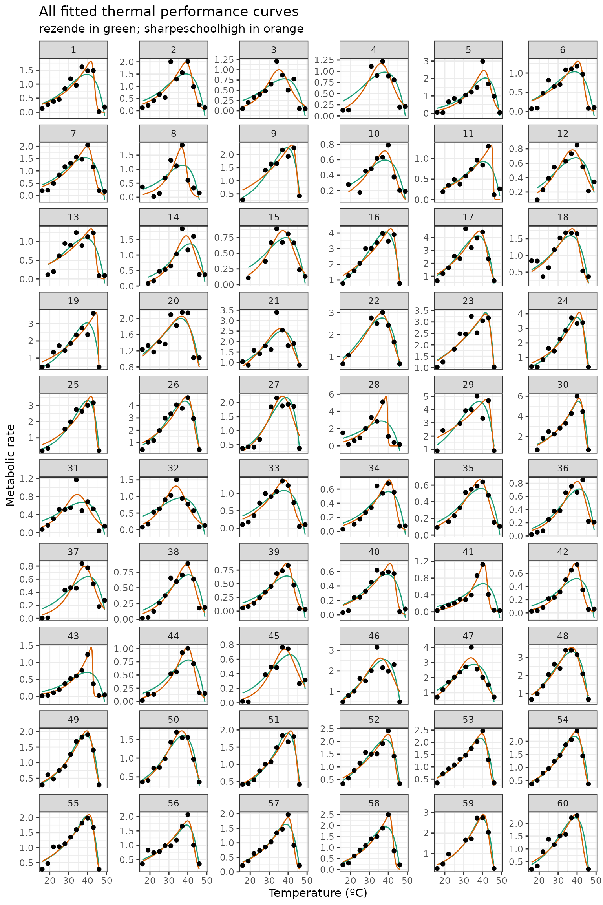

# Parallelising rTPC

##### A brief example of how to parallelise fitting many models to many TPCs using rTPC, nls.multstart the tidyverse, and mirai.

------------------------------------------------------------------------

### Things to consider

- **quickfit_tpc_multi()** makes assumptions about start values and
  currently does not support functions where you have to specify a
  reference temperature (e.g. **sharpe_schoolfield_1981()**). This is
  **by design** because you should think hard about the fitting process
  and writing your own functions will help you understand the process.
- We recommend writing your own functions for fitting models to pass to
  **purrr**.

``` r
# load in packages
library(rTPC)
library(nls.multstart)
library(broom)
library(tidyverse)
library(mirai)

# load in data
data('chlorella_tpc')
d <- chlorella_tpc
head(d)
#>   curve_id growth_temp     process        flux temp      rate
#> 1        1          20 acclimation respiration   16 0.1271258
#> 2        1          20 acclimation respiration   19 0.2659680
#> 3        1          20 acclimation respiration   22 0.3851324
#> 4        1          20 acclimation respiration   25 0.4518357
#> 5        1          20 acclimation respiration   28 0.8335710
#> 6        1          20 acclimation respiration   31 1.1903413
```

In our previous vignettes, we have shown how to fit many models to many
curves using **rTPC**, **nls.multstart()**, and the **tidyverse**.
However, as your datasets get larger (e.g. tens, hundreds, or thousands
of TPCs) this could take a long time to run.

Excitingly,
[**purrr**](https://www.tidyverse.org/blog/2025/07/purrr-1-1-0-parallel/)
now supports parallelisation when combined with
[**mirai**](https://mirai.r-lib.org/). This is the reason why we
recommend using a single **purrr::map()** call that encompasses all
models, as it integrates much better with **mirai** and allows for
parallelisation.

Even more excitingly, we have functions in **rTPC** that allow you to
easily fit one - **quickfit_tpc()** - or multiple -
**quickfit_multi_tpcs()**. These functions make some assumptions about
the start values and are not as customisable as each individual
function, so we still recommend writing your own functions, but these
are super useful if you want a quick idea of a few curves. Hats off to
Francis Windram for the amazing additions. We will use them here to
demonstrate how to parallelise fitting many models to many curves.

We will fit 5 models to all 60 TPCs in `chlorella_tpc`, demonstrating
how **quickfit_multi_tpcs()** can be used with and **purrr::map()**, and
how curve fitting can be sped up by parallelising using **mirai**. To
switch things up, the models we will fit are *briereextended_2021*,
*gaussianmodified_2006*, *briere1simplified_1999*,
*tomlinsonphillips_2015*, and *lactin2_1995*.

## quickfit_tpc_multi() without parallelisation

Firstly without parallelisation. We will time how long each method
takes. In **quickfit_tpc_multi()**, you can pass model specific
arguments by using a list. For example, here we pass different numbers
of iterations for each model, and mix a shotgun approach with a
gridstart approach between models. This could be useful if you know some
models are harder to fit than others.

``` r
# start timer
no_parallel_start <- Sys.time()

# fit multiple models to multiple curves
d_mods_nopara <- d %>%
  tidyr::nest(data = c(temp, rate)) %>%
  dplyr::mutate(
    mods = purrr::map(
      data,
      ~ quickfit_tpc_multi(
        data = .x,
        c(
          "briereextended_2021",
          "gaussianmodified_2006",
          "briere1simplified_1999",
          "tomlinsonphillips_2015",
          'lactin2_1995'
        ),
        "temp",
        "rate",
        iter = list(150, 150, c(4, 4, 4), 150, 200),
        lhstype = 'random'
      ),
      .progress = TRUE
    )
  ) %>%
  tidyr::unnest(mods)

# end timer
no_parallel_end <- Sys.time()
```

    #> ██████████████████████████████ 100% | ETA: 0s

## quickfit_tpc_multi() with parallelisation

And now with parallelisation, which you can read more about in the
[**purrr**
documentation](https://purrr.tidyverse.org/reference/in_parallel.html).
How and where parallelisation occurs is determined by
**mirai::daemons()** that sets up daemons (persistent background
processes that receive parallel computations) on your local machine or
across the network.

We only use 2 cores in our examples, but you can check how many you can
create using **parallel::detectCores()**

``` r
# start timer
parallel_start <- Sys.time()

# start parallel session
daemons(2)

# fit models as before, but in parallel
d_mods_para <- d %>%
  nest(data = c(temp, rate)) %>%
  mutate(
    mods = map(
      data,
      in_parallel(
        \(x) {
          library(rTPC)
          quickfit_tpc_multi(
            data = x,
            c(
              "briereextended_2021",
              "gaussianmodified_2006",
              "briere1simplified_1999",
              "tomlinsonphillips_2015",
              'lactin2_1995'
            ),
            "temp",
            "rate",
            iter = list(150, 150, c(4, 4, 4), 150, 200),
            lhstype = 'random'
          )
        }
      ),
      .progress = TRUE
    )
  ) %>%
  tidyr::unnest(mods)

# close parallel session
daemons(0)

# wait for 1 second to make sure it is closed
Sys.sleep(1)

# end time of parallel
parallel_end <- Sys.time()
```

    #> ██████████████████████████████ 100% | ETA: 0s

The non parallel code took 73 seconds, whereas the parallel code took 39
seconds, which is 1.9 times faster. That is a serious speed up!

The model fitting is likely to be the most time consuming part of the
pipeline, so it is unlikely you will need to parallelise any of the
other parts.

We can have a look at both objects to see that they are the same.

``` r
# look at colnames
colnames(d_mods_nopara)
#>  [1] "curve_id"               "growth_temp"            "process"               
#>  [4] "flux"                   "data"                   "briereextended_2021"   
#>  [7] "gaussianmodified_2006"  "briere1simplified_1999" "tomlinsonphillips_2015"
#> [10] "lactin2_1995"
colnames(d_mods_para)
#>  [1] "curve_id"               "growth_temp"            "process"               
#>  [4] "flux"                   "data"                   "briereextended_2021"   
#>  [7] "gaussianmodified_2006"  "briere1simplified_1999" "tomlinsonphillips_2015"
#> [10] "lactin2_1995"

# look at first six rows
head(d_mods_nopara)
#> # A tibble: 6 × 10
#>   curve_id growth_temp process     flux        data     briereextended_2021
#>      <dbl>       <dbl> <chr>       <chr>       <list>   <list>             
#> 1        1          20 acclimation respiration <tibble> <nls>              
#> 2        2          20 acclimation respiration <tibble> <nls>              
#> 3        3          23 acclimation respiration <tibble> <nls>              
#> 4        4          27 acclimation respiration <tibble> <nls>              
#> 5        5          27 acclimation respiration <tibble> <nls>              
#> 6        6          30 acclimation respiration <tibble> <nls>              
#> # ℹ 4 more variables: gaussianmodified_2006 <list>,
#> #   briere1simplified_1999 <list>, tomlinsonphillips_2015 <list>,
#> #   lactin2_1995 <list>
head(d_mods_para)
#> # A tibble: 6 × 10
#>   curve_id growth_temp process     flux        data     briereextended_2021
#>      <dbl>       <dbl> <chr>       <chr>       <list>   <list>             
#> 1        1          20 acclimation respiration <tibble> <nls>              
#> 2        2          20 acclimation respiration <tibble> <nls>              
#> 3        3          23 acclimation respiration <tibble> <nls>              
#> 4        4          27 acclimation respiration <tibble> <nls>              
#> 5        5          27 acclimation respiration <tibble> <nls>              
#> 6        6          30 acclimation respiration <tibble> <nls>              
#> # ℹ 4 more variables: gaussianmodified_2006 <list>,
#> #   briere1simplified_1999 <list>, tomlinsonphillips_2015 <list>,
#> #   lactin2_1995 <list>
```

## Custom rTPC parallelisation

As we said, **quickfit_tpc_multi()** makes some assumptions about start
values and the fitting process, so we still recommend writing your own
functions.

Here is an example of how to do this using **nls_multstart()** and
**purrr** with parallelisation. We will fit **sharpeschoolhigh_1981()**
and **rezende_2019()**. The overall structure is similar to we have used
in
[`vignette("fit_many_models")`](https://padpadpadpad.github.io/rTPC/articles/fit_many_models.md)
and
[`vignette("fit_many_curves")`](https://padpadpadpad.github.io/rTPC/articles/fit_many_curves.md).

The key difference when making things parallel is you need to specify
where every function inside your custom function come from using **::**
(for example **nls.multstart::nls_multstart()**.

``` r
# write a function to fit the five models and output a tibble
fit_TPCs <- function(d, ...) {
  rezende <- nls.multstart::nls_multstart(
    rate ~ rTPC::rezende_2019(temp = temp, q10, a, b, c),
    data = d,
    iter = c(4, 4, 4, 4),
    start_lower = rTPC::get_start_vals(
      d$temp,
      d$rate,
      model_name = 'rezende_2019'
    ) -
      10,
    start_upper = rTPC::get_start_vals(
      d$temp,
      d$rate,
      model_name = 'rezende_2019'
    ) +
      10,
    lower = rTPC::get_lower_lims(d$temp, d$rate, model_name = 'rezende_2019'),
    upper = rTPC::get_upper_lims(d$temp, d$rate, model_name = 'rezende_2019'),
    supp_errors = 'Y',
    convergence_count = FALSE,
    ...
  )
  sharpeschoolhigh <- nls.multstart::nls_multstart(
    rate ~
      rTPC::sharpeschoolhigh_1981(temp = temp, r_tref, e, eh, th, tref = 15),
    data = d,
    iter = c(4, 4, 4, 4),
    start_lower = rTPC::get_start_vals(
      d$temp,
      d$rate,
      model_name = 'sharpeschoolhigh_1981'
    ) -
      10,
    start_upper = rTPC::get_start_vals(
      d$temp,
      d$rate,
      model_name = 'sharpeschoolhigh_1981'
    ) +
      10,
    lower = rTPC::get_lower_lims(
      d$temp,
      d$rate,
      model_name = 'sharpeschoolhigh_1981'
    ),
    upper = rTPC::get_upper_lims(
      d$temp,
      d$rate,
      model_name = 'sharpeschoolhigh_1981'
    ),
    supp_errors = 'Y',
    convergence_count = FALSE,
    ...
  )

  return(tibble::tibble(
    rezende = list(rezende),
    sharpeschoolhigh = list(sharpeschoolhigh)
  ))
}

# start timer
custom_parallel_start <- Sys.time()

# start parallel session
daemons(2)

# fit models
d_fits <- d %>%
  nest(data = c(temp, rate)) %>%
  mutate(
    mods = map(
      data,
      in_parallel(
        \(x) {
          fit_TPCs(d = x)
        },
        fit_TPCs = fit_TPCs
      ),
      .progress = TRUE
    )
  ) %>%
  tidyr::unnest(mods)

# close parallel session
daemons(0)

# wait for 1 second to make sure it is closed
Sys.sleep(1)

# end time of parallel
custom_parallel_end <- Sys.time()
```

    #> ██████████████████████████████ 100% | ETA: 0s

This code took 57.59 seconds to run. We can then plot all the curves as
done in previous vignettes.

``` r
# create new list column of for high resolution data
d_preds <- mutate(
  d_fits,
  new_data = map(
    data,
    ~ tibble(temp = seq(min(.x$temp), max(.x$temp), length.out = 100))
  )
) %>%
  # get rid of original data column
  select(., -data) %>%
  # stack models into a single column, with an id column for model_name
  pivot_longer(
    .,
    names_to = 'model_name',
    values_to = 'fit',
    c(rezende, sharpeschoolhigh)
  ) %>%
  # create new list column containing the predictions
  # this uses both fit and new_data list columns
  mutate(preds = map2(fit, new_data, ~ augment(.x, newdata = .y))) %>%
  # select only the columns we want to keep
  select(curve_id, growth_temp, process, flux, model_name, preds) %>%
  # unlist the preds list column
  unnest(preds)

glimpse(d_preds)
#> Rows: 12,000
#> Columns: 7
#> $ curve_id    <dbl> 1, 1, 1, 1, 1, 1, 1, 1, 1, 1, 1, 1, 1, 1, 1, 1, 1, 1, 1, 1…
#> $ growth_temp <dbl> 20, 20, 20, 20, 20, 20, 20, 20, 20, 20, 20, 20, 20, 20, 20…
#> $ process     <chr> "acclimation", "acclimation", "acclimation", "acclimation"…
#> $ flux        <chr> "respiration", "respiration", "respiration", "respiration"…
#> $ model_name  <chr> "rezende", "rezende", "rezende", "rezende", "rezende", "re…
#> $ temp        <dbl> 16.00000, 16.33333, 16.66667, 17.00000, 17.33333, 17.66667…
#> $ .fitted     <dbl> 0.3090878, 0.3172922, 0.3257144, 0.3343602, 0.3432355, 0.3…
```

We can the plot the predictions of each curve using **ggplot2**.

``` r
# plot
ggplot(d_preds) +
  geom_line(aes(temp, .fitted, col = model_name)) +
  geom_point(aes(temp, rate), d) +
  facet_wrap(~curve_id, scales = 'free_y', ncol = 6) +
  theme_bw() +
  theme(legend.position = 'none') +
  scale_color_brewer(type = 'qual', palette = 2) +
  labs(
    x = 'Temperature (ºC)',
    y = 'Metabolic rate',
    title = 'All fitted thermal performance curves',
    subtitle = 'rezende in green; sharpeschoolhigh in orange'
  )
```


