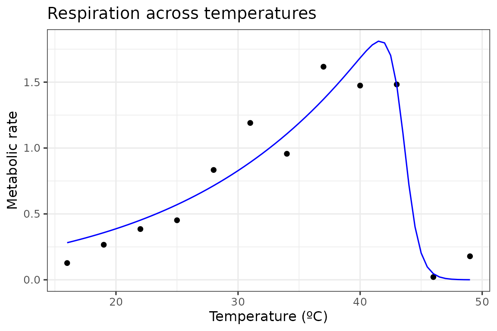

# Introduction to rTPC

#### An introduction to rTPC and how it can be used to fit thermal performance curves using nls.multstart.

------------------------------------------------------------------------

``` r
# load packages
library(rTPC)
library(nls.multstart)
library(broom)
library(tidyverse)
```

**rTPC** provides a suite of functions to help fit thermal performance
curves to empirical data. After searching the literature, **rTPC**
contains 49 different model formulations that have been used previously.
These functions can be easily applied to methods in R that use
non-linear least squares regression to estimate thermal performance
curves.

The available model formulations can be accessed using
**get_model_names()**.

``` r
# list model names
get_model_names()
#>  [1] "analytiskontodimas_2004"       "ashrafi1_2018"                
#>  [3] "ashrafi2_2018"                 "ashrafi3_2018"                
#>  [5] "ashrafi4_2018"                 "ashrafi5_2018"                
#>  [7] "atkin_2005"                    "beta_2012"                    
#>  [9] "betatypesimplified_2008"       "boatman_2017"                 
#> [11] "briere1_1999"                  "briere1simplified_1999"       
#> [13] "briere2_1999"                  "briere2simplified_1999"       
#> [15] "briereextended_2021"           "briereextendedsimplified_2021"
#> [17] "delong_2017"                   "deutsch_2008"                 
#> [19] "eubank_1973"                   "flextpc_2024"                 
#> [21] "flinn_1991"                    "gaussian_1987"                
#> [23] "gaussianmodified_2006"         "hinshelwood_1947"             
#> [25] "janisch1_1925"                 "janisch2_1925"                
#> [27] "joehnk_2008"                   "johnsonlewin_1946"            
#> [29] "kamykowski_1985"               "lactin2_1995"                 
#> [31] "lobry_1991"                    "mitchell_2009"                
#> [33] "oneill_1972"                   "pawar_2018"                   
#> [35] "quadratic_2008"                "ratkowsky_1983"               
#> [37] "rezende_2019"                  "rosso_1993"                   
#> [39] "sharpeschoolfull_1981"         "sharpeschoolhigh_1981"        
#> [41] "sharpeschoollow_1981"          "spain_1982"                   
#> [43] "stinner_1974"                  "taylorsexton_1972"            
#> [45] "thomas_2012"                   "thomas_2017"                  
#> [47] "tomlinsonphillips_2015"        "warrendreyer_2006"            
#> [49] "weibull_1995"
```

They are generally named after the author of the paper (and hence the
name of the model within the literature) and the year at which I found
the model to be first used, separated by a **“\_”**. Some original model
formulations have been altered so that all models take temperature in
degrees centigrade and raw rate values as input.

We can demonstrate the fitting procedure by taking a single curve from
the example dataset **rTPC** - a dataset of 60 TPCs of respiration and
photosynthesis of the aquatic algae, *Chlorella vulgaris*. We can plot
the data using **ggplot2**.

``` r
# load in data
data("chlorella_tpc")

# keep just a single curve
d <- filter(chlorella_tpc, curve_id == 1)

# show the data
ggplot(d, aes(temp, rate)) +
  geom_point() +
  theme_bw(base_size = 12) +
  labs(
    x = 'Temperature (ºC)',
    y = 'Metabolic rate',
    title = 'Respiration across temperatures'
  )
```


For each model, **rTPC** has helper functions that estimate sensible
start values (**get_start_vals()**), lower (**get_lower_lims()**) and
upper (**get_upper_lims()**) limits. To demonstrate this, we shall use
the sharpe-schoolfield model for high temperature inactivation only.

``` r
# choose model
mod = 'sharpschoolhigh_1981'

# get start vals
start_vals <- get_start_vals(
  d$temp,
  d$rate,
  model_name = 'sharpeschoolhigh_1981'
)

# get limits
low_lims <- get_lower_lims(d$temp, d$rate, model_name = 'sharpeschoolhigh_1981')
upper_lims <- get_upper_lims(
  d$temp,
  d$rate,
  model_name = 'sharpeschoolhigh_1981'
)

start_vals
#>     r_tref          e         eh         th 
#>  0.7485827  0.8681437  2.4861344 43.0000000
low_lims
#> r_tref      e     eh     th 
#>      0      0      0      1
upper_lims
#>    r_tref         e        eh        th 
#>  1.616894 10.000000 40.000000 49.000000
```

One problem with most methods of fitting models in R using non-linear
least squares regression is that they are sensitive to the choice of
starting parameters. This problem also occurs in previous specialist R
packages that help fit thermal performance curves, such as
[devRate](https://github.com/frareb/devRate/) and
[temperatureresponse](https://github.com/low-decarie/temperatureresponse).
These methods can fail entirely or give different parameter estimates
between multiple runs of the same code.

To overcome this, we recommend using the R package
[**nls.multstart**](https://github.com/padpadpadpad/nls.multstart),
which uses **minpackLM::nlsLM()**, but allows for multiple sets of
starting parameters. It iterates through multiple starting values,
attempting a fit with each set of start parameters. The best model is
then picked using AIC scores.

Using **nls_multstart()**, we will use Latin Hypercube Sampling (LHS),
which can only be used when `iter` is set to a single number. Instead of
sampling from a uniform distribution across the bounds of each
parameter, these methods try to take a set of samples from the range of
parameter values that covers the parameter space optimally for any given
set of parameters. *This approach can result in less iterations being
needed to get the same reliability of model fitting than either the
shotgun or grid-start approaches*.

``` r
# fit model
fit <- nls_multstart(
  rate ~ sharpeschoolhigh_1981(temp = temp, r_tref, e, eh, th, tref = 15),
  data = d,
  iter = 500,
  start_lower = start_vals - 10,
  start_upper = start_vals + 10,
  lower = low_lims,
  upper = upper_lims,
  supp_errors = 'Y',
  lhstype = 'random'
)

fit
#> Nonlinear regression model
#>   model: rate ~ sharpeschoolhigh_1981(temp = temp, r_tref, e, eh, th,     tref = 15)
#>    data: data
#>  r_tref       e      eh      th 
#>  0.2595  0.5826 14.2031 43.5531 
#>  residual sum-of-squares: 0.3144
#> 
#> Number of iterations to convergence: 21 
#> Achieved convergence tolerance: 1.49e-08
```

To calculate additional parameters of interest, we can use
**rTPC::calc_params()**. This function uses high resolution predictions
of the fitted model to estimate traits associated with a thermal
performance curve. The currently available methods can be viewed by
running
[`?calc_params`](https://padpadpadpad.github.io/rTPC/reference/calc_params.md).
For example, we may be interested in variation in the optimum
temperature, \\T\_{opt}\\, given that we adapted algae to different
temperatures.

``` r
# calculate additional traits
calc_params(fit) %>%
  # round for easy viewing
  mutate_all(round, 2)
#>   rmax  topt ctmin ctmax    e    eh  q10 thermal_safety_margin
#> 1 1.81 41.65  2.54 45.56 0.58 11.48 2.06                  3.91
#>   thermal_tolerance breadth skewness
#> 1             43.02    5.37    -10.9
```

Finally for this introduction, we can get predictions of our model using
**broom::augment()**, which is similar to **predict()**. These are then
plotted over our original data.

``` r
# predict new data
new_data <- data.frame(temp = seq(min(d$temp), max(d$temp), 0.5))
preds <- augment(fit, newdata = new_data)

# plot data and model fit
ggplot(d, aes(temp, rate)) +
  geom_point() +
  geom_line(aes(temp, .fitted), preds, col = 'blue') +
  theme_bw(base_size = 12) +
  labs(
    x = 'Temperature (ºC)',
    y = 'Metabolic rate',
    title = 'Respiration across temperatures'
  )
```



Built in 2.9005938s
